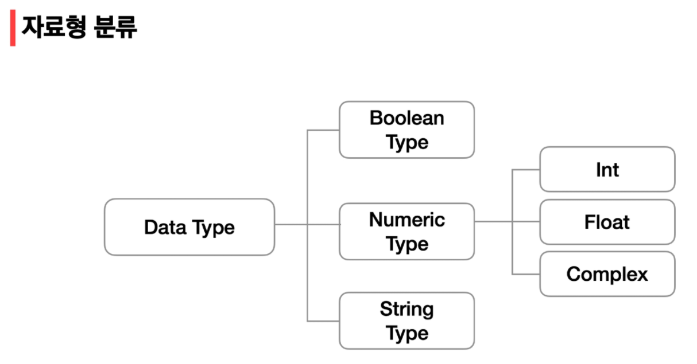
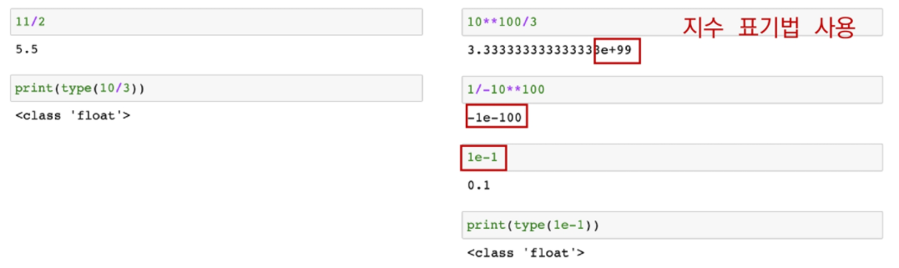
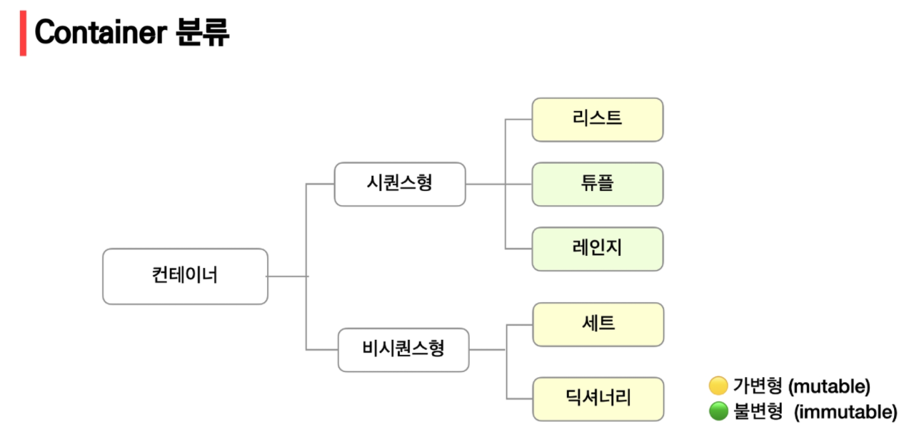
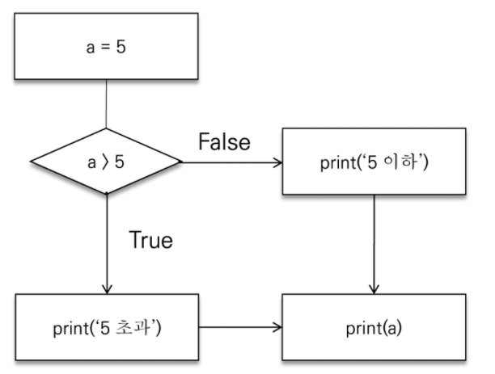
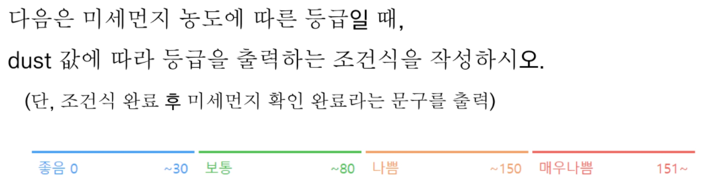
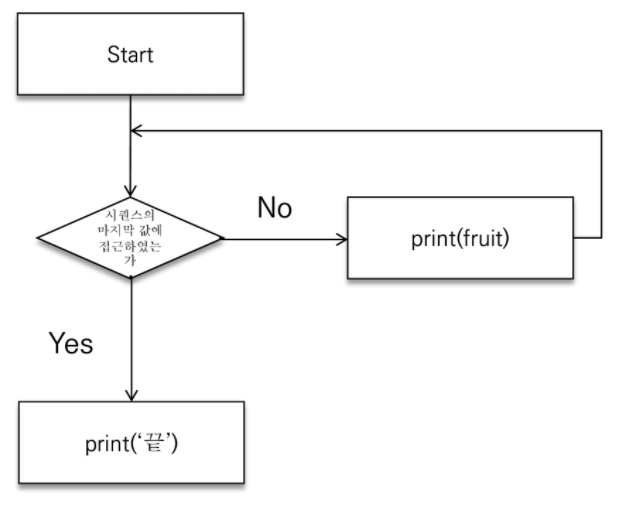

*2022.01.17.월*

# 데이터 & 제어문

## 1. 기초 문법

* 파이썬에서 제안하는 스타일 가이드

  * PEP8 (https://www.python.org/dev/peps/pep-0008/)

* **변수**란?

  * 컴퓨터 메모리 어딘가에 저장되어 있는 객체를 참조하기 위해 사용되는 이름

    * 객체 (object) : 숫자, 문자, 클래스 등 값을 가지고 있는 모든 것
      * 파이썬은 객체지향 언어이며, 모든 것이 객체로 구현되어 있음

  * 변수는 할당 연산자(=) 를 통해 값을 할당

    * `type()` : 변수에 할당된 값의 타입

    * `id()` : 변수에 할당된 값(객체)의 고유한 identity 값이며, 메모리 주소

      ```python
      >>> x = 'test'
      >>> type(x)
      <class 'str'>
      >>> id(x)
      2538867408240
      ```

  * 같은 값을 동시에 할당할 수 있음

  * 다른 값을 동시에 할당할 수 있음

  * (문제) `x = 10, y = 20` 일 때, 각각 값을 바꿔서 저장하는 코드를 작성하시오.

    ```python
    x,y = 10, 29
    
    # 방법1 (주로 사용되는 방법)
    tmp = x
    x = y
    y = tmp
    
    # 방법2 (pythonic!)
    y,x = x,y
    ```

* **식별자** (Identifiers)

  * 파이썬 객체 (변수, 함수, 모듈, 클래스 등) 를 식별하는데 사용하는 이름(name)

  * 규칙

    * 식별자의 이름은 영문 알파벳, 언더스코어(_), 숫자로 구성

    * 첫 글자에 숫자가 올 수 없음

    * 길이제한이 없고, 대소문자를 구별

    * 다음의 키워드(keywords) 는 예약어(reserved words)로 사용할 수 없음

      ```python
      >>> import keyword
      >>> print(keyword.kwlist)
      ['False', 'None', 'True', '__peg_parser__', 'and', 'as', 'assert', 'async', 'await', 'break', 'class', 'continue', 'def', 'del', 'elif', 'else', 'except', 'finally', 'for', 'from', 'global', 'if', 'import', 'in', 'is', 'lambda', 'nonlocal', 'not', 'or', 'pass', 'raise', 'return', 'try', 'while', 'with', 'yield']
      ```

    * 내장함수나 모듈 등의 이름으로도 만들면 안됨

      * 기존의 이름에 다른 값을 할당하게 되므로 더 이상 동작하지 않음

* **주석** (Comment)

  * 한 줄 주석 : `#`

  * 여러 줄의 주석 : `"""` 또는 `'''`

    

## 2. 파이썬 자료형



### 2.1 None

* 파이썬 자료형 중 하나
* 값이 없음을 표현하기 위한 타입인 NoneType

```python
>>> print(type(None))
<class 'NoneType'>
>>> a = None
>>> print(a)
None
```

* 일반적으로 반환 값이 없는 함수에서 사용하기도 함


### 2.2 Boolean

* True/False 값을 가진 타입은 bool
* 비교/논리 연산을 수행함에 있어서 활용됨
* 다음은 모두 False로 변환
  * `0, 0.0, (), [], {}, '', None`


### 2.3 수치형 (Numeric Type)

#### 2.3.1 int

* 모든 정수의 타입은 int
* 매우 큰 수를 나타낼 때 오버플로우가 발생하지 않음
  * 오버플로우 (overflow) : 데이터 타입별로 사용할 수 있는 메모리의 크기를 넘어서는 상황

---

**[파이썬 3에는 오버플로우가 없다.]**

https://ahracho.github.io/posts/python/2017-05-09-python-integer-overflow/

- 파이썬 2에서는 정수형 데이터 타입이 int와 long 두 가지가 있었는데, int는 C에서의 그것과 같은 4바이트 데이터형이고, long은 arbitrary precision을 따르는 데이터형이다. 그래서 int 타입 변수의 값이 표현 범위를 넘어서게 되면 자동으로 long으로 타입 변경이 되는 형식이었다.
- 파이썬 3에서는 long 타입이 없어지고 int 타입만 남았는데, 이 int가 arbitrary precision을 지원하여 오버플로우가 발생하지 않게 되었다.
- 하지만 파이썬3에서도 pydata stack을 사용하는 numpy/pandas 같은 패키지를 사용할 때는 C 스타일이 유지되기 때문에 오버플로우 발생을 고려해야 한다.

>  **arbitrary precision??**
>
> In computer science, arbitrary-precision arithmetic, also called bignum arithmetic, multiple precision arithmetic, or sometimes infinite-precision arithmetic, indicates that calculations are performed on numbers whose digits of precision are limited only by the available memory of the host system. (Wikipedia) 즉, arbitrary-precision은 사용할 수 있는 메모리양이 정해져 있는 기존의 fixed-precision과 달리, 현재 남아있는 만큼의 가용 메모리를 모두 수 표현에 끌어다 쓸 수 있는 형태를 이야기하는 것 같다. 예를 들어 특정 값을 나타내는데 4바이트가 부족하다면 5바이트, 더 부족하면 6바이트까지 사용할 수 있게 유동적으로 운용한다는 것이다.

---

* 진수 표현

  ```python
  >>> 0b10
  2
  >>> 0o30
  24
  >>> 0x10
  16
  ```


#### 2.3.2 float

*  정수가 아닌 모든 실수는 float 타입

* 부동소수점

  * 실수를 컴퓨터가 표현하는 방법 - 2진수(bit)로 숫자를 표현

  * 이 과정에서 `floating point rounding error` 가 발생하여 , 예상치 못한 결과가 발생

    

    > 값 비교하는 과정에서 정수가 아닌 실수인 경우 주의할 것
    >
    > 매우 작은 수보다 작은지를 확인하거나 math 모듈 활용 (**math.isclose 추천**)
    >
    > 

#### 2.3.3 복소수 (Complex)

허수부를 j로 표현

```python
>>> a = 3+4j
>>> print(type(a))
<class 'complex'>
>>> a.real
3.0
>>> a.imag
4.0
>>> print(a)
(3+4j)
```


### 2.4 문자열 (String Type)

* 모든 문자는 str 타입
* `'` `"` 를 활용하여 표기
* 중첩 따옴표
  * 따옴표 안에 따옴표를 표현할 경우 : 작은 따옴표가 들어있는 경우는 큰 따옴표로 문자열 생성

* 삼중 따옴표

  * 따옴표 안에 따옴표를 넣을 때
  * 여러 줄을 나눠 입력할 때 편리

  ``` python
  >>> print('''문자열 안에 '작은 따옴표'나
  "큰 따옴표"를 사용할 수 있고
  여러 줄을 사용할 때도 편리하다.''')
  문자열 안에 '작은 따옴표'나
  "큰 따옴표"를 사용할 수 있고
  여러 줄을 사용할 때도 편리하다.
  ```

* Escape sequence

  * 문자열 내에서 특정 문자나 조작을 위해서 역슬래시(\)를 활용하여 구분

* String Interpolation

  * 문자열을 변수를 활용하여 만드는 법

    * %-formatting

      ```python
      >>> name = 'kim'
      >>> print('Hello, %s' % name)
      Hello, kim
      ```

    * str.format()

      ```python
      >>> name = 'kim'
      >>> score = 4.5
      >>> print('Hello, {}! 성적은 {}'.format(name, score))
      Hello, kim! 성적은 4.5
      ```

    * f-string : python 3.6+

      ```python
      >>> name = 'kim'
      >>> score = 4.5
      >>> print(f'Hello, {name}! 성적은 {score}')
      Hello, kim! 성적은 4.5
      ```


### 2.5 컨테이너 (Container)

* 여러 개의 값을 담을 수 있는 것(객체)으로, 서로 다른 자료형을 저장할 수 있음
  * ex) List, tuple




## 3. 시퀀스형 컨테이너

### 3.1 List - []

* 순서를 가지는 0개 이상의 객체를 참조하는 자료형
* **생성된 이후 내용 변경이 가능**
* 순서가 있는 시퀀스로 인덱스를 통해 접근 가능

### 3.2 Tuple - ()

* 순서를 가지는 0개 이상의 객체를 참조하는 자료형

* **생성 후, 담고있는 객체 변경이 불가**

* 수정 불가능한 (immutable) 시퀀스로 인덱스로 접근 가능

  ```python
  # 단일 항목의 경우
  >>> a = 1,
  >>> print(a)
  (1,)
  >>> print(type(a))
  <class 'tuple'>
  # 복수 항목의 경우
  >>> b = 1,2,3
  >>> print(b)
  (1, 2, 3)
  >>> print(type(b))
  <class 'tuple'>
  ```

* 튜플 대입

  * 우변의 값을 좌변의 변수에 한번에 할당하는 과정

    ```python
    >>> x, y = (1, 2)
    >>> print(x, y)
    1 2
    ```

    

### 3.3 Range

* **숫자의 시퀀스를 나타내기 위해 사용**
  * 기본형 : `range(n)`
    * 0부터 n-1 까지
  * 범위 지정 : `range(n,m)`
    * n부터 m-1까지
  * 범위 및 스텝 지정 : `range (n,m,s)`
    * n부터 m-1까지 s만큼 증가


### 3.4 패킹/언패킹 (Packing/Unpacking) *

#### 3.4.1 패킹

* 대입문의 좌변 변수에 위치

* 우변의 객체 수가 좌변의 변수 수보다 많을 경우 객체를 순서대로 대입

* 나머지 항목들은 모두 별 기호 표시된 변수에 **리스트로 대입**

  ```python
  >>> x, *y = 1,2,3,4,5
  >>> print(x, type(x))
  1 <class 'int'>
  >>> print(y, type(y))
  [2, 3, 4, 5] <class 'list'>
  ```

#### 3.4.2 언패킹

* argument 이름이 * 로 시작하는 경우, argument unpacking 이라 함

* 언패킹의 경우 **튜플 형태로 대입**

  ```python
  >>> def multiply(x,y,z):
  	return x*y*z
  
  >>> numbers = [1,2,3]
  >>> multiply(*numbers)
  6
  ```

> 별표(*) 연산자가 곱셈을 의미하는지 Packing/Unpacking 연산자인지 구분


## 4. 비시퀀스형 컨테이너

### 4.1 Set - {}

* 순서없이 0개 이상의 해시가능한 객체를 참조하는 자료형

* 담고 있는 객체를 삽입, 변경, 삭제 가능 -> 가변 자료형(mutable)

* 집합과 동일한 구조 : 집합 연산 가능, 중복된 값 존재하지 않음

* 순서가 없어 별도의 값에 접근할 수 없음

* 빈 중괄호는 dictionary

  * 빈 set을 만들기 위해서는 set()을 반드시 활용해야 함

* set의 활용

  * set을 활용하면 다른 컨테이너에서 중복된 값을 쉽게 제거할 수 있음

  * 단, 이후 순서가 무시되므로 순서가 중요한 경우 사용할 수 없음 (순서 무작위)

    ```python
    >>> my_list = ['서울', '서울', '대전', '구미', '구미']
    >>> print(set(my_list))
    {'서울', '대전', '구미'}
    ```

    

### 4.2 Dictionary

* 순서없이 key-value 쌍으로 이루어진 객체를 참조하는 자료형

  * key : 해시 가능한 **불변 자료형**(immutable)만 가능
  * value : 어떠한 형태든 관계 없음 (List, Dictionary 등)

* 생성 방법

  ```python
  >>> dict_a = {'a':'apple', 'b':'banana'}
  >>> print(dict_a)
  {'a': 'apple', 'b': 'banana'}
  >>> 
  >>> dict_b = dict(a='apple', b='banana')
  >>> print(dict_b)
  {'a': 'apple', 'b': 'banana'}
  ```

  

### 4.3 Typecasting

* 파이썬에서 데이터 형태는 서로 변환할 수 있음
  * 암시적 형변환 : 의도하지 않고, 파이썬 내부적으로 자료형을 변환하는 경우
  * 명시적 형변환 : `int`, `float`, `str`


## 5. 연산자 (Operator)

* 산술 연산자 : `+, -, *, /, //, **`

* 비교 연산자 : `<, <=, >, >=, ==, !=, is, is not`

* 논리 연산자 : `and, or, not`

  * 일반적으로 비교 연산자와 함께 사용됨
  * 결과가 확실한 경우 두번째 값은 확인하지 않음 - 첫번째 값 반환
    * and 연산에서 첫번째 값이 False 인 경우 무조건 False - 첫번째 값 반환
    * or 연산에서 첫번째 값이 True 인 경우 무조건 True  - 첫번째 값 반환

* 복합 연산자 : `+=`

* 멤버십 연산자 : `in, not in`

  * 시퀀스 포함 여부 확인

* 식별 연산자 : `is` 연산자를 통해 동일한 객체인지 확인 가능함 (OOP에서 추가학습)

* 기타 (Indexing/Slicing)

  * `+` : 시퀀스 간의 연결

  * `*` : 시퀀스를 반복

  * Indexing : 시퀀스의 특정 인덱스 값에 접근

    ```python
    >>> [1,2,3][2]
    3
    ```

  * Slicing : 시퀀스를 특정 단위로 슬라이싱

    ```python
    >>> [1,2,3,4,5][1:4]
    [2, 3, 4]
    >>> s = 'abcdefghi'
    >>> s[::]
    'abcdefghi'
    >>> s[::-1]
    'ihgfedcba'
    ```

* set 연산자

  * `|` : 합집합
  * `&` : 교집합
  * `-` : 여집합
  * `^` : 대칭차

## 6. 컨테이너 (Container) 정리

컨테이너 간의 형 변환은 아래와 같이 가능


## 7. 제어문 (Control Statement)

* 파이썬은 기본적으로 위에서부터 아래로 순차적으로 명령을 수행
* 특정 상황에 따라 코드를 선택적으로 실행(분기/조건)하거나 계속하여 실행하는 제어가 필요함
* 제어문은 순서도 (flow chart)로 표현이 가능

### 7.1 조건문

#### 7.1.1 조건문 기본

 조건문은 참/거짓을 판단할 수 있는 조건식과 함께 사용

* 아래의 순서도를 코드로 나타내면?

  

  ```python
  a = 5
  if a > 5:
      print('5 초과')
  else:
  	print('5 이하')
  print(a)
  ```

#### 7.1.2 복수 조건문

* 복수 조건식을 활용할 경우 elif 를 활용하여 표현함



```python
dust = 80
if dust > 150:
    print('매우나쁨')
elif dust > 80:
    print('나쁨')
elif dust > 30:
    print('보통')
else:
    print('좋음')
print('미세먼지 확인 완료')
```

#### 7.1.3 중첩 조건문

* 조건문은 다른 조건문에 중첩되어 사용될 수 있음
  * 들여쓰기를 유의하여 작성할 것

#### 7.1.4 조건 표현식 (Conditional Expression)

* 조건 표현식을 일반적으로 조건에 따라 값을 정할 때 활용

* 삼항 연산자(Ternary Operator)로 부르기도 함

  ```python
  <true인 경우 값>if<expression>else<false인 경우 값>
  value = num if num >= 0 else -num
  ```

  > 절대값을 저장하기 위한 코드


### 7.2 반복문

* 특정 조건을 도달할 때 까지 계속 반복되는 일련의 문장

#### 7.2.1 while

* 조건식이 참인 경우 반복적으로 코드를 실행

* 무한 루프를 하지 않도록 종료 조건이 반드시 필요

* 1부터 사용자가 입력한 양의 정수까지의 총합을 구하는 코드를 작성하시오

  ```python
  # 값 초기화
  n = 0
  total = 0
  user_input = int(input())
  # 반복문
  while n < user_input:
      total += n
      n += 1
  print(total)
  ```

#### 7.2.2 for

* 시퀀스 `string, tuple, list, range` 를 포함한 순회 가능한 객체 (iterable) 요소를 모두 순회함

* 처음부터 끝까지 모두 순회하므로 별도의 종료조건이 필요하지 않음

* 아래 순서도를 코드로 나타내시오

  

  ```python
  for fruit in ['apple', 'mango', 'banana']:
      print(fruit)
  print('끝')
  ```

* 딕셔너리 (Dictionary) 순회

  * 기본적으로 key  를 순회하며, key 를 통해 값을 활용한다.

  ``` python
  >>> grades = {'john':80, 'eric':90}
  >>> for student in grades:
  	print(student)
  
  	
  john
  eric
  >>> grades = {'john':80, 'eric':90}
  >>> for student in grades:
  	print(student, grades[student])
  
  	
  john 80
  eric 90
  ```

* 추가 메서드 활용

  ```python
  >>> grades = {'john':80, 'eric':90}
  >>> print(grades.keys())
  dict_keys(['john', 'eric'])
  >>> print(grades.values())
  dict_values([80, 90])
  >>> print(grades.items())
  dict_items([('john', 80), ('eric', 90)])
  ```

* enumerate() 순회

  * `enumerate(iterable, start=0)`
  * 인덱스와 객체를 쌍으로 담은 열거형 객체 반환
  * (index, value) 형태의 tuple 로 구성된 열거 객체를 반환

  ```python
  >>> members = ['민수', '영희', '철수']
  >>> for idx, member in enumerate(members):
  	print(idx, member)
  
  	
  0 민수
  1 영희
  2 철수
  ```

* List Comprehension

  * 표현식과 제어문을 통해 특정한 값을 가진 리스트를 간결하게 생성하는 방법

    `<expression>for< 변수>in<iterable>`

    `<expression>for< 변수>in<iterable>if<조건식>`

  * (예시) 1~3의 세제곱의 결과가 담긴 리스트를 만드시오

    ```python
    >>> [number**3 for number in range(1,4)]
    [1, 8, 27]
    ```

* Dictionary Comprehension

  * 표현식과 제어문을 통해 특정한 값을 가진 딕셔너리를 간결하게 생성하는 방법

    `key:value for <변수> in <iterable>`

    `key:value for <변수> in <iterable> if <조건식>`

  * (예시) 1~3 의 세제곱의 결과가 담긴 딕셔너리를 만드시오

    ```python
    >>> {number:number**3 for number in range(1,4)}
    {1: 1, 2: 8, 3: 27}
    ```

    

#### 7.2.3 반복문 제어

##### 7.2.3.1 break

* 반복문을 종료

##### 7.2.3.2 continue

* continue 이후의 코드블록은 수행하지 않고, 다음 반복을 수행

##### 7.2.3.3 for-else

* 끝까지 반복문을 실행한 이후에 else 문 실행
* break 를 통해 중간에 종료되는 경우 else문은 실행되지 않음

```
for char in 'apple':
	if char == 'b':
		print('b!')
		break
else:
	print('b가 없습니다.')
```

##### 7.2.3.4 pass

* 아무것도 하지 않음
* 특별히 할 일이 없을 때 자리를 채우는 용도로 사용
* 반복문 아니어도 사용 가능

```python
for i int range(5):
    if i==3:
        pass
    print(i)
```

