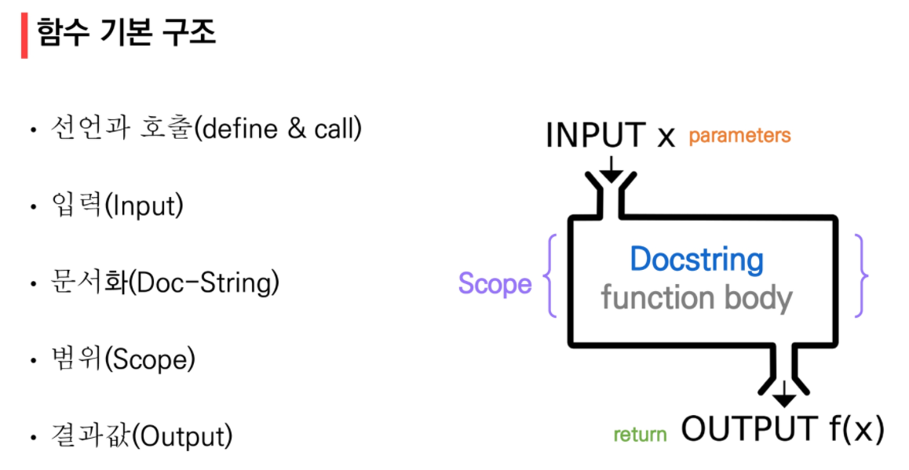

*2022.01.19.수*

> 참고 : https://pythontutor.com/


# 함수

## 1. 함수 기초

### 1.1 함수 (Function)

* 특정한 기능을 하는 코드의 조각(묶음)
* 특정 명령을 수행하는 코드를 매번 다시 작성하지 않고, 필요 시에만 호출하여 간편히 사용

**함수를 사용해야하는 이유?**

* 코드 중복 방지
* 재사용 용이


### 1.2 사용자 함수 (Custom Function)

* 구현되어 있는 함수가 없는 경우, 사용자가 직접 함수를 작성 가능

```python
def function_name(parameter):
    # code block
    return returning value
```




## 2. 함수의 결과값 (Output)

* void function

  * 명시적인 return 값이 없는 경우, `None`을 반환하고 종료

    ```python
    >>> a = print('test')
    test
    >>> print(a)
    None
    ```

* value returning function

  * 함수 실행 후, return 문을 통해 값 반환
  * 함수는 항상 단일한 값만을 반환
  * return 문을 한번만 사용하면서 두개 이상의 값을 반환하는 방법?
    * 반환값으로 `튜플`사용


## 3. 함수의 입력 (Input)

### 3.1 Parameter와 Argument

```python
def say_anything(a): # parameter
	print(f'hello {a}')
	
say_anything('python') # argument
```

```bash
hello python
```

* Parameter : 함수를 실행할 때, 함수 내부에서 사용되는 식별자
* Argument : 함수를 호출할 때, 넣어주는 값
  * **Positional Arguments**
    * 기본적으로 함수 호출 시 Argument는 위치에 따라 함수 내에 전달됨
  * **Keyword Arguments**
    * 직접 변수의 이름으로 특정 Argument를 전달할 수 있음
    * *(함수 호출 시 주의) Keyword Argument 다음에 Positional Argument를 활용할 수 없음*
  * **Default Argument Values**
    * 기본값을 지정하여 함수 호출 시 argument값을 설정하지 않도록 함
    * 정의된 것 보다 더 적은 개수의 argument들로 호출될 수 있음
    * *(함수 정의 시 주의) 기본값을 가지는 argument 다음에 기본 값이 없는 argument로 정의할 수 없음*


* Positional Arguments packing/unpacking

  * 여러 개의 positional argument를 하나의 필수 parameter로 받아서 사용
  * 몇 개의 positional argument를 받을지 모르는 함수를 정의할 때 유용

  ```python
  def add(*args):
      for arg in args:
          print(arg)
  add(2)
  add(2,3,4,5)
  ```

* Keyword Arguments packing/unpacking

  * 함수가 임의의 개수 argument 를 keyword argument로 호출될 수 있도록 지정
  * argument들은 딕셔너리로 묶여 처리되며, parameter에 ** 를 붙여 표현

  ```python
  def family(**kwargs):
      for key, value in kwargs:
          print(key, ":", value)
  family(father='John', mother='Jane', me='John Jr.')
  ```

  

## 4. 함수의 범위 (Scope)

* scope
  * global scope : 코드 어디에서든 참조할 수 있는 공간
  * local scope : 함수가 만든 scope. 함수 내부에서만 참조 가능

* variable
  * gloabl variable : global scope 에 정의된 변수
  * local variable : local scope 에 정의된 변수

### 4.1 LEGB; 이름 검색 규칙 (Name Resolution)

파이썬에서 사용되는 이름(식별자)들은 이름공간(namespace)에 저장되어 있음

아래와 같은 순서로 이름을 찾아나가며, LEGB rule 에 따름

* **L**ocal scope : 함수
* **E**nclosed scope : 특정 함수의 상위 함수
* **G**lobal scope : 함수 밖의 변수, import 모듈
* **B**uilt-in scope : 파이썬 안에 내장되어 있는 함수 또는 속성

### 4.2 global

* 현재 코드 블록 전체에 적용되며, 나열된 식별자(이름)이 global variable임을 나타냄
  * global 에 나열된 이름은 같은 코드블록에서 global 앞에 등장할 수 없음
  * global 에 나열된 이름은 parameter, for 루프 대상, 클래스/함수 정의 등으로 정의되지 않아야 함

### 4.3 nonlocal

* global을 제외하고 가장 가까운 scope 의 변수를 연결하도록 함
  * nonlocal 에 나열된 이름은 같은 코드블록에서 nonlocal 앞에 등장할 수 없음
  * nonlocal 에 나열된 이름은 parameter, for 루프 대상, 클래스/함수 정의 등으로 정의되지 않아야 함
* global 과는 달리 이미 존재하는 이름과의 연결만 가능함

### 4.4 범위 확인하기

* locals() : locals() 가 실행되어지는 함수 내의 local namespace들을 딕셔너리로 정리
* globals() : global, local, built-in 정보 모두 딕셔너리로 정리

## 5. 함수의 문서화 (Doc-String)

* Docstring
  * 함수나 클래스의 설명
  * jupyter notebook에서 함수에 커서를 놓고 `shift + tab`

## 6. 함수 응용

### 6.1 map (function, iterable)

* 순회 가능한 데이터구조 (iterable) 의 모든 요소에 함수(function) 을 적용하고, 그 결과를 map object 로 반환

* 활용

  * 알고리즘 문제 풀이 시 input 값을 숫자로 바로 활용하고 싶을 때

  ```python
  >>> n, m = map(int, input().split())
  1 2
  >>> print(n, m)
  1 2
  >>> print(type(n), type(m))
  <class 'int'> <class 'int'>
  ```

  

### 6.2 filter (function, iterable)

* 순회 가능한 데이터구조 (iterable) 의 모든 요소에 함수(function) 을 적용하고, 그 결과가 True인 것들은 filter object 로 반환

```python
>>> numbers = [1,2,3]
>>> result = filter(odd, numbers)
>>> print(result, type(result))
<filter object at 0x0000024EEA0893A0> <class 'filter'>
>>> list(result) # 리스트 형변환을 통해 결과 확인
[1, 3]
```


### 6.3 zip (*iterables)

* 복수의 iterable 을 모아 튜플을 원소로 하는 zip object 를 반환

```python
>>> girls = ['jane', 'ashley']
>>> boys = ['justin', 'eric']
>>> pair = zip(girls, boys)
>>> print(pair, type(pair))
<zip object at 0x0000024EEA0A4E00> <class 'zip'>
>>> list(pair) # 리스트 형변환을 통해 결과 확인
[('jane', 'justin'), ('ashley', 'eric')]
```


### 6.4 lambda [parameter] : 표현식

`lambda [parameter] : 표현식`

* 표현식을 계산한 결과값을 반환하는 함수고, 이름이 없는 함수여서 익명함수라고도 불림
* return 문을 가질 수 없음
* 간편 조건문 외 조건문이나 반복문을 가질 수 없음

* 예시

  ```python
  >>> triangle_area = lambda b, h : 0.5 * b * h
  >>> triangle_area(5,6)
  15.0
  ```

  

### 6.5 재귀 함수 (recursive function)

* 자기 자신을 호출하는 함수
* 1개 이상의 base case(종료되는 상황) 가 존재하고, 수렴하도록 작성

* 주의 사항
  * base case 에 도달할 때 까지 함수를 호출함
  * 메모리 스택이 넘치게 되면 (stack overflow) 프로그램이 동작하지 않게 됨
  * 파이썬에서는 최대 재귀 깊이 (maximun recursion depth) 가 1,000번으로,
    호출 횟수가 이를 넘어가게 되면 Recursion Error 발생
* 반복문과 재귀 함수 비교
  * 알고리즘 자체가 재귀적인 표현이 자연스러운 경우 재귀함수를 사용함
  * 재귀 호출은 변수 사용을 줄여줄 수 있음
  * 재귀 호출은 입력 값이 커질수록 연산속도가 오래걸림


>일급 객체 (1급 객체, First-class citizen)
>
>일급 객체란 다른 객체들에 일반적으로 적용 가능한 연산을 모두 지원하는 객체를 가리킨다.
>
>참고 : https://velog.io/@reveloper-1311/%EC%9D%BC%EA%B8%89-%EA%B0%9D%EC%B2%B4First-Class-Object%EB%9E%80
>
>
>
>[일급 객체의 조건]
>
>* 변수에 할당(assginment)할 수 있다.
>* 다른 함수를 인자(argument)로 전달 받는다.
>* 다른 함수의 결과로서 리턴될 수 있다.
>
>
>
>함수가 일급 객체이기 때문에 할 수 있는 것?
>
>* 고차 함수를 만들 수 있다.
>* 콜백(callback)을 사용할 수 있다.
