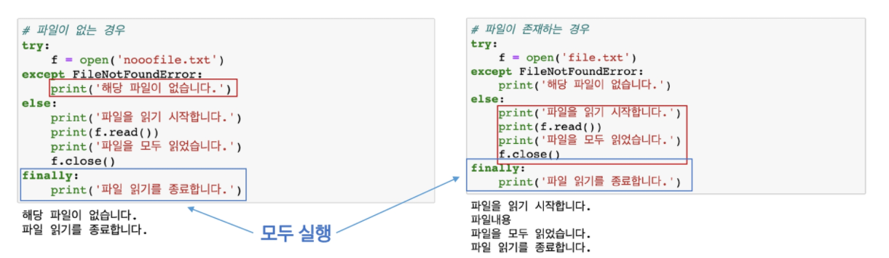

*2022.01.24.월요일*

# 에러/예외 처리

에러/예외 처리는 알고리즘에서는 거의 쓰이지 않음

나중에 개발 실무에서나 오픈소스 기여 시 활용할 수 있음

## 1. 에러와 예외

* 실행 도중 예상치 못한 상황을 맞이하면, 프로그램 실행을 멈춤
* 예외 (Exception) : 실행 중에 감지되는 에러
* 모든 내장 예외는 Exception Class 를 상속받아 이뤄짐
* 사용자 정의 예외를 만들어 관리할 수 있음

## 2. 예외 처리

* `try`
  * 코드를 실행함
* `except`
  * try 문에서 예외가 발생 시 실행함
  * `as` : as 키워드를 활용하여 원본 에러메시지를 사용할 수 있다.
* `else`
  * try 문에서 예외가 발생하지 않으면 실행함
* `finally`
  * 예외 발생 여부와 관계없이 항상 실행함

> `if ... else` 와 다른점?
>
> `if ... else` 는 오류가 발생하면 멈출 것이다. `try ... except` 는 오류가 발생하면 예외 사항에 대한 동작을 수행한다는 차이점이 있다.

## 3. 예외 발생 시키기

* `raise`
  * 예외를 강제로 발생
* `assert` [조건], [오류 메시지]
  * 조건이 True이면 그대로 코드 진행, False이면 AssertionError 발생
  * 일반적으로 디버깅 용도로 사용

