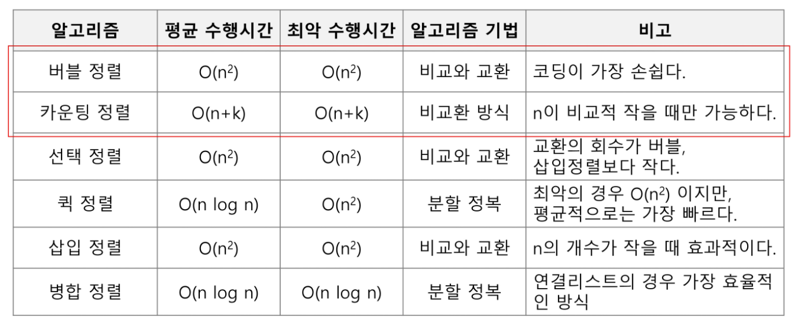

*2022.02.09*

# 알고리즘

컴퓨터가 어떤 일을 수행하기 위한 단계적 방법

## 빅-오 표기법

* 알고리즘의 작업량을 표현할 때 시간 복잡도를 이용한다.

* 시간 복잡도 함수 중에서 가장 큰 영향력을 주는 n 에 대한 항만을 표시
* 계수는 생략하여 표시

# 정렬

## 버블 정렬 (Bubble Sort)

인접한 두 개의 원소를 비교하며 자리를 계속 교환하는 방식

한 단계가 끝나면 가장 큰 원소가 마지막 자리로 정렬된다.

## 카운팅 정렬 (Counting Sort)

항목들의 순서를 결정하기 위해 집합에 각 항목이 몇개씩 있는지 세는 작업을 하여, 선형 시간에 정렬하는 효율적인 알고리즘

## 선택 정렬 (Selection Sort)

주어진 리스트중에 최소값을 찾아 그 값을 맨 앞에 위치한 값과 교체한다.

맨 처음 위치를 뺀 나머지 리스트를 같은 방법으로 교체한다.

## 퀵 정렬 (Quick Sort)

## 삽입 정렬 (Insertion Sort)

## 병합 정렬 (Merge Sort)

## stable sort

* 중복된 키를 순서대로 정렬하는 알고리즘
* 같은 값이 2개 이상인 경우, 기존 리스트에 있던 순서대로 중복된 키들이 정렬된다는 것을 의미
* why stable sort?
  * stable sort 로 정렬하는 알고리즘들의 순서는 항상 똑같기에 항상 결과가 같음을 보장할 수 있다.
* Stable Sort
  * Insertion Sort
  * Merge Sort
  * Bubble Sort
  * Counting Sort
* Unstable Sort
  * Heap Sort
  * Selection Sort
  * Shell Sort
  * Quick Sort

## In-place Algorithm

* 추가적인 메모리 공간을 많이 필요로 하지 않는, 혹은 전혀 필요로 하지 않는 알고리즘을 의미한다.
* n 길이의 리스트가 있고, 이 리스트를 정렬할 때 추가적으로 메모리 공간을 할당하지 않아도 정렬이 이루어진다면 in-place 알고리즘

* In-place Algorithm
  * Insertion Sort
  * Selection Sort
  * Bubble Sort
  * Shell Sort
  * Heap Sort
  * Quick Sort
* Not in-place Algorithm
  * Merge Sort
  * Counting Sort