*2022.02.03*

# WEB (HTML & CSS)

> 여러가지의 태그들이 각각의 웹 브라우저에서 지원되는지 알려주는 사이트
>
> https://caniuse.com/
>
> - 초록색 = 지원함
> - 빨간색 = 지원하지 않음
> - 노란색 = 부분적으로 지원함
> - 회색 = 지원여부를 아직 모름

# HTML

* Hyper Text Markup Language
  * Hyper Text : 참조(하이퍼링크)를 통해 사용자가 한 문서에서 다른 문서로 즉시 접근할 수 있는 텍스트
  * Markup Language : 태그 등을 이용하여 문서나 데이터의 구조를 명시하는 언어
    * ex) HTML, Markdown

## HTML 기본 구조

* `<!DOCTYPE html>` :  해당 문서가 html5 로 구성되어 있음 (생략 가능), 구버전 브라우저(IE) 사용하는 경우 호환성을 위해 명시하는 것이 좋음
* `html` : 문서의 최상위 요소
* `head` : 문서 메타 데이터 요소
  * 문서 제목, 인코딩, 스타일, 외부 파일 로딩 등
  * 일반적으로 브라우저에 나타나지 않는 내용
  * `<title>` : 브라우저 상단 타이틀
  * `<meta>` : 문서 레벨 메타데이터 요소
  * `<link>` : 외부 리소스 연결 요소 (CSS, favicon)
  * `<script>` : 스크립트 요소 (JavaScript 파일/코드), body 에도 들어갈 수 있음
  * `<style>` : CSS 직접 작성
  * Open Graph Protocol
    * 메타 데이터를 표현하는 새로운 규약
* `body` : 문서 본문 요소
  * 실제 화면 구성과 관련된 내용

### DOM(Document Object Model) 트리

* **텍스트 파일인 HTML 문서를 브라우저에서 렌더링하기 위한 구조**
  * HTML 문서에 대한 모델을 구성함
  * HTML 문서 내의 각 요소에 접근/수정에 필요한 프로퍼티와 메서드를 제공함
* 요소 (element) : 태그 + 내용

### 요소 (element)

* HTML 요소는 시작 태그와 종료 태그, 그리고 태그 사이에 위치한 내용으로 구성
* 내용이 없는 태그들
  * `br, hr, img, input, link, meta`
* 요소는 중첩(nested) 될 수 있음
  * 요소의 중첩을 통해 하나의 문서를 구조화
  * 여는 태그와 닫는 태그의 쌍을 잘 확인해야 함
    * 오류를 반환하는 것이 아닌 그냥 레이아웃이 깨진 상태로 출력되기 때문에 디버깅이 힘들어 질 수 있음

### 속성 (attribute)

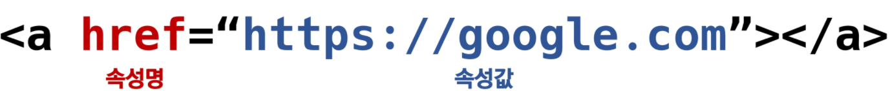

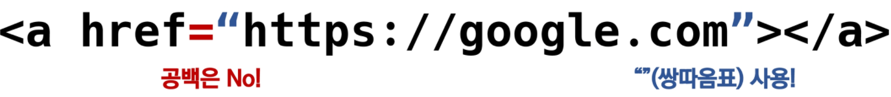

* 속성을 통해 태그의 부가적인 정보를 설정할 수 있음
* 요소는 속성을 가질 수 있으며, 경로나 크기와 같은 추가적인 정보를 제공
* 요소의 시작태그에 작성하며 보통 이름과 값이 하나의 쌍으로 존재
* 태그와 상관없이 사용 가능한 속성(HTML Global Attribute)들도 있음

> MDN web docs
>
> 사용법 검색 시 사용

#### HTML Global Attribute

* 모든 HTML 요소가 사용할 수 있는 대표적인 속성 (몇몇 요소에는 아무 효과가 없을 수 있음)
* ⭐id : 문서 전체에서 유일한 고유 식별자 지정
* ⭐class : 공백으로 구분된 해당 요소의 클래스 목록 (CSS, JS 에서 요소를 선택하거나 접근)
* data-* : 페이지에 개인 사용자 정의 데이터를 저장하기 위해 사용
* style : inline 스타일
* title : 요소에 대한 추가 정보 지정
* tabindex : 요소의 탭 순서

### 시맨틱 태그⭐

* **HTML5 에서 의미론적 요소를 담은 태그의 등장**
  * 기존 영역을 의미하는 div 태그를 대체하여 사용
  * Non Semantic 요소는 `div, span`등이 있으며 `h1, table` 태그들도 시맨틱 태그로 볼 수 있음
  * 개발자 및 사용자 뿐만 아니라 검색엔진 등에 의미있는 정보의 그룹을 태그로 표현
  * 단순히 구역을 나누는 것 뿐만 아니라 '의미'를 가지는 태그들을 활용하기 위한 노력
  * 요소의 의미가 명확해지기 때문에 코드의 가독성을 높이고 유지보수를 쉽게 함
  * 검색엔진최적화(SEO)를 위해서 매타태그, 시맨틱 태그 등을 통한 마크업을 효과적으로 활용 해야함
* `header` : 문서 전체나 섹션의 헤더 (머리말 부분)
* `nav` : 내비게이션
* `aside` : 사이드에 위치한 공간, 메인 콘텐츠와 관련성이 적은 콘텐츠
* `section ` : 문서의 일반적인 구분, 컨텐츠의 그룹을 표현 
* `article` : 문서, 페이지, 사이트 안에서 독립적으로 구분되는 영역
* `footer` : 문서 전체나 섹션의 푸터(마지막 부분)

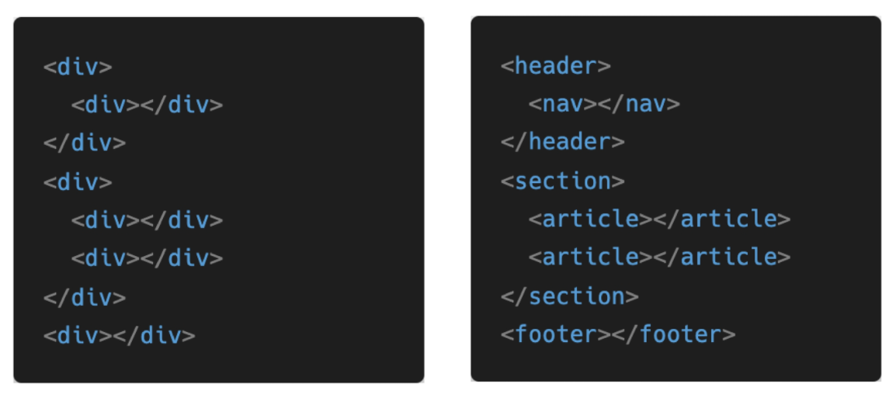

## HTML 문서 구조화

### 인라인/블록 요소

### 텍스트 요소

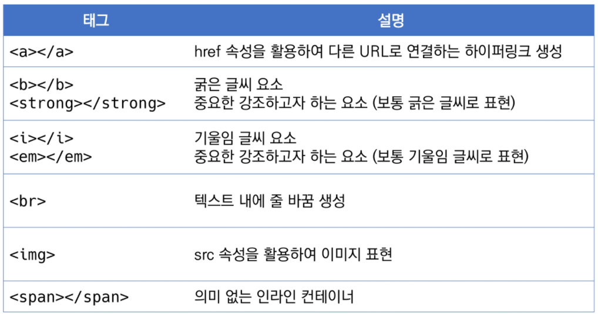

* `<strong>, <em>`: '강조'의 의미를 가지는 ***시맨틱 태그***

### 그룹 컨텐츠

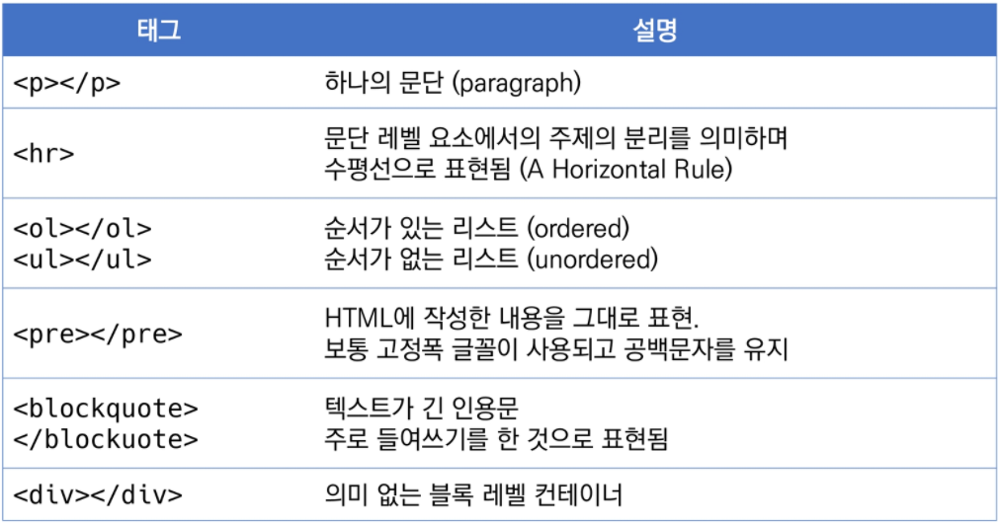

### table

* theader, tbody, tfoot 요소를 활용하여 table 의 각 영역을 명시

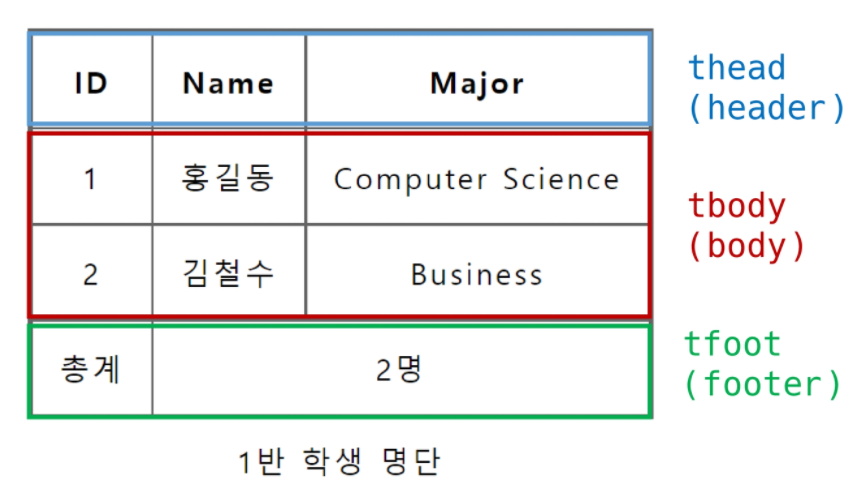

* `<tr>` 로 가로줄을 구성하고 내부에는 `<th>` 혹은 `<td>` 로 셀을 구성

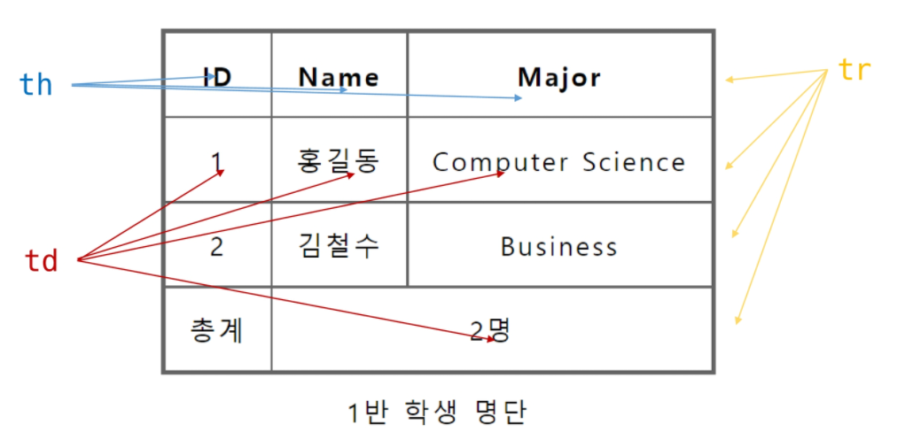

```htm
    <table>
      <thead>
        <tr>
          <th>ID</th>
          <th>Name</th>
          <th>Major</th>
        </tr>
      </thead>
      <tbody>
        <tr>
          <td>1</td>
          <td>홍길동</td>
          <td>Computer Science</td>
        </tr>
        <tr>
          <td>2</td>
          <td>김철수</td>
          <td>Business</td>
        </tr>
      </tbody>
      <tfoot>
        <tr>
          <td>총계</td>
          <td colspan="2">2명</td>
        </tr>
      </tfoot>
      <caption>1반 학생 명단</caption>
    </table>
```

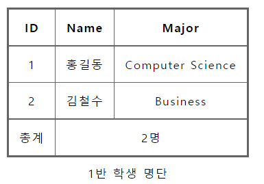

### form ⭐⭐⭐

* **`<form>`은 정보(데이터)를 서버에 제출하기 위한 영역** 
* 기본 속성
  * **action : form 을 처리할 서버의 URL**
  * method : form 을 제출할 때 사용할 HTTP 메서드 (GET 혹은 POST)
  * enctype : method 가 post 인 경우 데이터의 유형
    * application/x-www-form-urlencoded : 기본값
    * multipart/form-data : 파일 전송 시 (input type 이 file인 경우)
    * text/plain : HTML5 디버깅 용 (잘 사용되지 않음)

### input

* 다양한 입력을 가지는 입력 데이터 유형과 위젯이 제공됨
* name : form control 에 적용되는 이름 (이름/값 페어로 전송됨)
* value : form control 에 적용되는 값 (이름/값 페어로 전송됨)
* required, readonly, autofocus, autocomplete, disabled : 단일 속성(속성 값 없이 속성 명만 있어도 동작함)
* `<input type="submit">`
  * 사용할 수 있는 type 에는 text, password, email, number, file, checkbod, radio 등등이 있음


* input label

  * label을 클릭하여 input 자체의 초점을 맞추거나 활성화 시킬 수 있음
  * 사용자는 선택할 수 있는 영역이 늘어나 웹/모바일(터치) 환경에서 편하게 사용할 수 있음
  * label  과 input 입력의 관계가 시각적 뿐만 아니라 화면 리더기에서도 label 을 읽어 쉽게 내용을 확인할 수 있도록 함
  * `<input>`에 id 속성을, `<label>`에는 for 속성을 활용하여 상호 연관을 시킴

  ```HTML
  <label for="agreement">개인 정보 수집에 동의합니다.</label>
  <input type="checkbox" name="agreement" id="agreement">
  ```

   

# CSS

* CSS (Cascading Style Sheets) : 스타일을 지정하기 위한 언어
* 세미콜론 필수
* CSS 구문은 선택자를 통해 스타일을 지정할 HTML 요소를 선택
* 중괄호 안에서는 속성과 값, 하나의 쌍으로 이루어진 선언을 진행
* 각 쌍은 선택한 요소의 속성, 속성에 부여할 값을 의미.
  * 속성 (Property) : 어떤 스타일 기능을 변경할지 결정
  * 값 (Value) : 어떻게 스타일 기능을 변경할지 결정

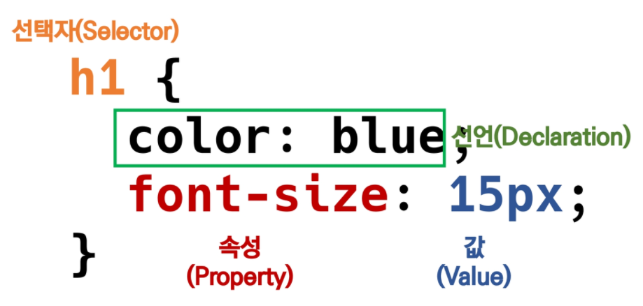

* CSS 정의 방법
  * 인라인 (inline)
    * 해당 태그에 직접 style 속성을 활용
  * 내부 참조 (embedding) - `<style>`
    * `<head>` 태그 내에 `<style>` 에 지정
  * 외부 참조 (link file) - 분리된 CSS 파일
    * 외부 CSS 파일을 `<head>`내 `<link>` 를 통해 불러오기
    * 재사용성 높음

* CSS 우선순위 - 순서와도 영향이 있음(가장 마지막에 선언된 것이 적용됨)


## CSS Selectors ⭐⭐⭐⭐⭐

* **기본 선택자**
  * 전체 선택자, 요소 선택자
  * 클래스 선택자(.), 아이디 선택자(#), 속성 선택자
* **결합자** (Combinators)
  * 자손 결합자, 자식 결합자
  * 일반 형제 결합자, 인접 형제 결합자
* 의사 클래스/요소 (Pseudo Class)
  * 링크, 동적 의사 클래스
  * 구조적 의사 클래스, 기타 의사 클래스, 의사 엘리먼트, 속성 선택자

### CSS 적용 우선순위 (cascading order) ⭐⭐⭐⭐⭐

1. 중요도(Important)
   * `!important`
2. 우선순위
   * **인라인 > id > class**, *속성, pseudo-class* **>  요소**, *pseudo-element* **> 전체** 선택자
3. CSS 파일 로딩 순서
   * 가장 마지막이 우선순위가 높다.

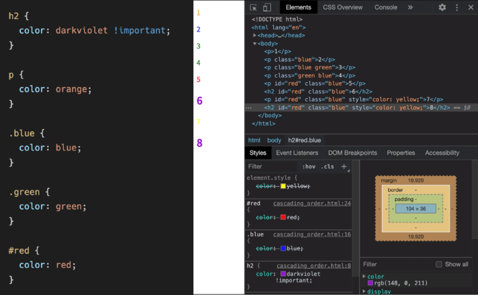

### CSS 상속

* Text 관련 요소만 상속이 된다.

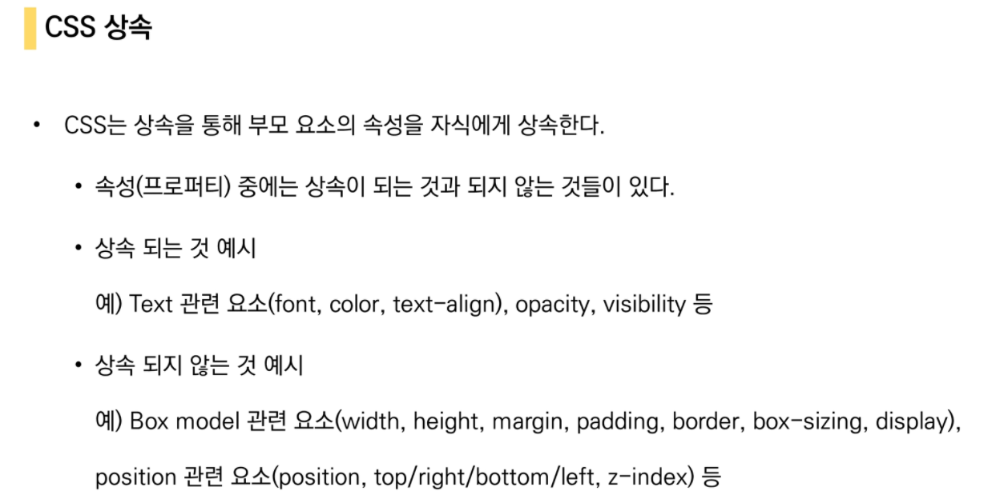

## CSS 기본 스타일

* 크기 단위
  * px(픽셀)
    * 모니터 해상도의 한 화소인 '픽셀'기준
    * 픽셀의 크기는 변하지 않기 때문에 고정적인 단위
  * %
    * 백분율 단위
    * 가변적인 레이아웃에서 자주 사용
    * ex) 부모요소의 width 의 60%
  * em
    * (바로 위 부모 요소에 대한) 상속의 영향을 받음
    * ex) 1.5em -> 부모 요소의 1.5배
  * rem
    * 최상위 요소(html) 의 사이즈를 기준으로 배수 단위를 가짐
  * viewport
    * 웹페이지를 방문한 유저에게 바로 보이게 되는 웹 컨텐츠 영역
    * 디바이스의 viewport 를 기준으로 상대적인 사이즈가 결정됨


## Selectors 심화

* 자손 결합자
  * selector A 하위의 모든 selector B 요소
  * 띄어쓰기로 자손을 표현 `li p`
* 자식 결합자
  * selector A 바로 아래의 selector B 요소 `li > p`
* 일반 형제 결합자
  * selector A 의 형제 요소 중 뒤에 위치하는 selector B 요소를 모두 선택
  * `p ~ span`
* 인접 형제 결합자
  * selector A 의 형제 요소 중 바로 뒤에 위치하는 selector B 요소를 선택
  * `p + span`


## CSS Box model

> 모든 요소는 네모(박스모델)이고,
>
> 위에서부터 아래로, 왼쪽에서 오른쪽으로 쌓인다.

* 모든 HTML 요소는 box 형태로 되어있음

* 하나의 박스는 네 영역으로 이루어짐

  * content / padding / border / margin

    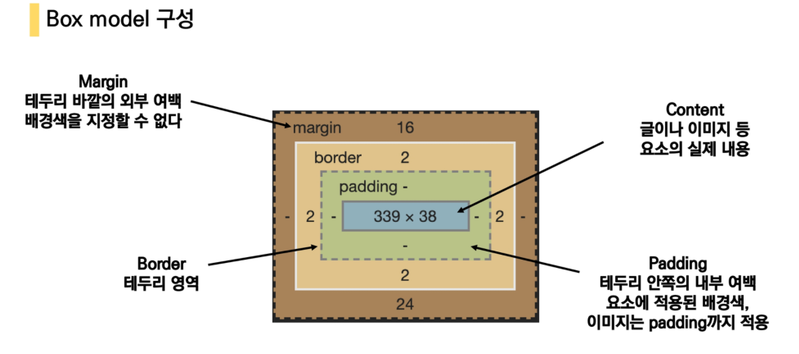

* shorthand

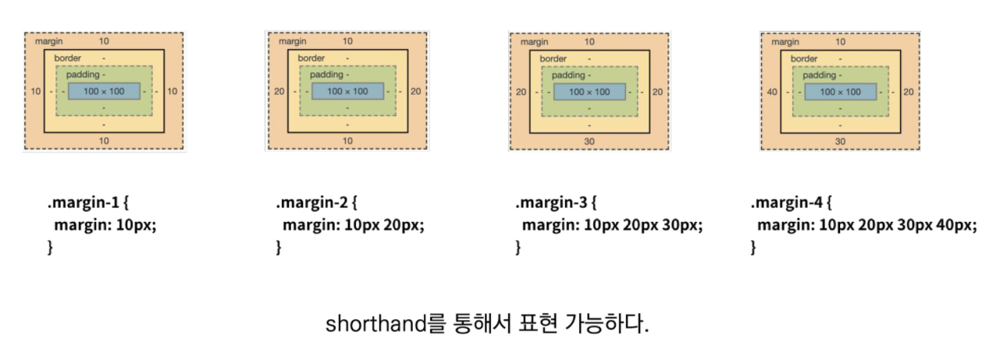

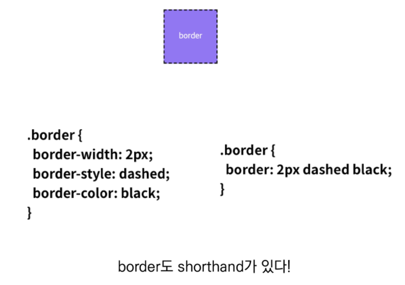

### box-sizing ⭐⭐⭐

* content-box
* border-box


## CSS Display

> 모든 요소는 네모(박스모델) 이고, 좌측 상단에 배치,
>
> **display에 따라 크기와 배치가 달라진다.**

* display : block
  * 줄바꿈이 일어나는 요소
  * 화면 크기 전체의 가로 폭을 차지한다.
  * 블록 레벨 요소 안에 인라인 레벨 요소가 들어갈 수 있음
  * `div / ul, ol, li / p / hr / form`등
* display : inline
  * 줄 바꿈이 일어나지 않는 행의 일부 요소
  * content 너비만큼 가로 폭을 차지한다.
  * width, height, margin-top, margin-bottom 을 지정할 수 없다.
  * 상하 여백은 line-height 로 지정한다.
  * `span / a / img / input, label / b, em, i, strong` 등

* display : inline-block
  * block 과 inline 레벨 요소의 특징을 모두 가짐
  * inline 처럼 한 줄에 표시 가능하고, block 처럼 width, height, margin 속성을 모두 지정할 수 있음
* display : none
  * 해당 요소를 화면세 표시하지 않고, 공간조차 부여되지 않음
  * `visibility : hidden` 과의 차이점⭐ 해당 요소가 공간은 차지하나 화면에 표시만 하지 않는다.


## CSS Position⭐⭐⭐

* 문서 상에서 요소를 위치를 지정

* static : 모든 태그의 기본 값(기준 위치)

  * 일반적인 요소의 배치 순서에 따름 (normal flow)
  * 부모 요소 내에서 배치될 때는 부모요소의 위치를 기준으로 배치 됨

* 아래는 좌표 프로퍼티(top, bottom, left, right)를 사용하여 이동 가능

  > ⭐⭐⭐*relative 와 absolute 차이 중요*

  * static
    * position 지정하지 않은 상태
  * relative
    * 상대위치
    * **내 자리 유지**
    * **자기 자신의 static 위치를 기준**으로 이동, 나머지 요소들은 normal flow 유지
    * 레이아웃에서 요소가 차지하는 공간은 static 일 때와 같음
  * absolute
    * 절대 위치
    * **내 자리 X**
    * 요소를 normal flow 에서 제거 후 레이아웃에 공간을 차지하지 않음
    * **static이 아닌 가장 가까이 있는 부모/조상 요소를 기준**으로 이동 (없는 경우 body)
  * fixed
    * 고정 위치
    * **내 자리 X**
    * 요소를 normal flow 에서 제거 후 레이아웃에 공간을 차지하지 않음
    * 부모 요소와 관계없이 **viewport 를 기준**으로 이동 (스크롤 시에도 항상 같은 곳에 위치함)

## CSS 원칙 정리

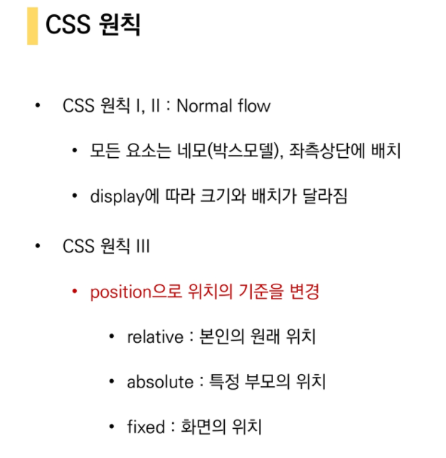


# 참고

## emmet

https://docs.emmet.io/cheat-sheet/

* HTML & CSS 를 작성할 때 보다 빠른 마크업을 위해 사용되는 오픈소스
* 단축키, 약어 등을 사용
* 대부분의 텍스트 에디터에서 지원