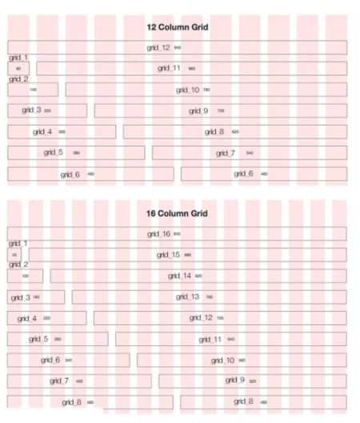

# 그리드 시스템/반응형 웹

## CSS

```
💡선택자 연습용 사이트
https://flukeout.github.io/
```


## CSS Layout

### CSS 원칙 Ⅰ(Normal Flow)⭐

* 모든 요소는 네모(박스모델)이고, 위에서부터 아래로, 왼쪽에서 오른쪽으로 쌓인다.


### float

* 박스를 왼쪽 혹은 오른쪽으로 이동시켜 텍스트를 포함 ***인라인 요소들이 주변을 wrapping*** 하도록 함
* 요소가 Normal Flow 를 벗어나도록 함


#### float 속성

* none : 기본값
* left : 요소를 왼쪽으로 띄움
* right : 요소를 오른쪽으로 띄움


#### Clearing Float

1. float 요소의 부모를 div 를 감싸준다.
2. 부모에게 clearfix class 적용

```html
.clearfix::after {
	content: "";
	display: block;
	clear: both;
}
```

* Float 는 Normal Flow 에서 벗어나 부동 상태 (떠 있음)
* 따라서, 이후 요소에 대하여 Float 속성이 적용되지 않도록 Clearing 이 필수적임
  * `::after` : 선택한 요소의 맨 마지막 자식으로 가상요소를 하나 생성
    * 보통 content 속성과 함께 짝지어, 요소에 장식용 콘텐츠를 추가할 때 사용
  * clear 속성 부여
* flaot 는 block 레이아웃의 사용을 뜻하기 때문에 inline 요소에 적용하게 되면 block 요소로 바뀌어 적용된다.

> 💡Float 활용 전략 - Normal Flow 에서 벗어난 레이아웃 구성
>
> 	- 원하는 요소들을 float 로 지정하여 배치
> 	- 부모 요소에 반드시 clearing float 를 하여 이후 요소부터 normal flow 를 가지도록 규정


### flexbox ⭐

* 행과 열 형태로 아이템을 배치하는 1차원 레이아웃 모델

* 축

  * main axis

  * cross axis

  * flex-direction : row

    

* Flexbox 구성 요소

  * Flew Container (부모 요소)

    * flexbox 레이아웃을 형성하는 가장 기본적인 모델

    * Flex Item 들이 놓여있는 영영

    * 💡display 속성을 flex 혹은 inline-flex 로 지정

      ```css
      .flex-container {
          display: flex;
      }
      ```

  * Flex Item (자식 요소)

    * 컨테이너에 속해 있는 컨텐츠

> Q. 왜 Flexbox 를 사용해야 할까?
>
> float 혹은 position 을 통해서는 
>
> 	1. 수직 정렬
> 	1. 아이템의 너비와 높이 혹은 간격을 동일하게 배치
>
> 하는 것이 어렵다.

#### flex 속성

[배치 설정]

* flex-direction

  * main axis 기준 방향 설정

    

* flex-wrap

  * 아이템이 컨테이너를 벗어나는 경우 해당 영역 내에 배치되도록 설정

  * nowarp(기본 값) : 한 줄에 배치

  * wrap : 넘치면 그 다음줄로 배치

    


[공간 나누기]

* justify-content : Main axis 를 기준으로 공간 배분

  * flex-start (기본 값) : 아이템을 axis 시작점으로
  * flex-end : 아이템들을 axis 끝 쪽으로
  * center : 아이템들을 axis 중앙으로
  * space-between : 아이템 사이의 간격을 균일하게 분배
  * space-around : 아이템을 둘러싼 영역을 균일하게 분배 (가질 수 있는 영역을 반으로 나눠서 양쪽에)
  * space-evenly : 전체 영역에서 아이템 간 간격을 균일하게 분배

  

* align-content : Cross axis 를 기준으로 공간 배분


[정렬]

* align-items : 모든 아이템을 Cross axis 를 기준으로 정렬

  * stretch (기본 값) : 컨테이너를 가득 채움
  * flex-start : 위
  * flex-end : 아래
  * center : 가운데
  * baseline : 텍스트 baseline 에 기준선을 맞춤

  

* align-self : 개별 아이템을 Cross axis 를 기준으로 정렬 (컨테이너가 아닌 개별 아이템에 적용하는 속성)

  

[기타 속성]

* flex-grow : 남은 영역을 아이템에 분배⭐
* order : 배치 순서⭐

```text
💡Flexbox Froggy (https://flexboxfroggy.com/#ko)
* flexbox 연습용 사이트
```

* flex-shrink
* flex-basis

### grid


## bootstrap

* 웹사이트를 쉽게 만들 수 있게 도와주는 HTML, CSS, JS 프레임워크
* 하나의 CSS 로 휴대폰, 태블릿, 데스크탑까지 다양한 기기에서 작동한다.
* 사용법


* 더 편한 사용법 : CDN (Content Delivery Network)

  * 컨텐츠 (CSS, JS, Image, Text 등)을 효율적으로 전달하기 위해 여러 노드에 가진 네트워크에 데이터를 제공하는 시스템
  * https://www.bootstrapcdn.com/

  ```HTML
  <link rel="stylesheet" href="https://cdn.jsdelivr.net/npm/bootstrap@5.1.3/dist/css/bootstrap.min.css" integrity="sha384-1BmE4kWBq78iYhFldvKuhfTAU6auU8tT94WrHftjDbrCEXSU1oBoqyl2QvZ6jIW3" crossorigin="anonymous">
  <script src="https://cdn.jsdelivr.net/npm/bootstrap@5.1.3/dist/js/bootstrap.min.js" integrity="sha384-QJHtvGhmr9XOIpI6YVutG+2QOK9T+ZnN4kzFN1RtK3zEFEIsxhlmWl5/YESvpZ13" crossorigin="anonymous"></script>
  ```

* spacing

  

  

## bootstrap grid system

### Grid System (web design)

* 요소들의 디자인과 배치에 도움을 주는 시스템

* 기본 요소

  * Column : 실제 컨텐츠를 포함하는 부분

  * Gutter : 칼럼과 칼럼 사이의 공간 (사이 간격)

  * Container : Column 들을 담고 있는 공간

    

* Bootstrap Grid System 은 flexbox 로 제작됨

  ```
  💡 12개의 column
  💡 6개의 grid breakpoints
  ```