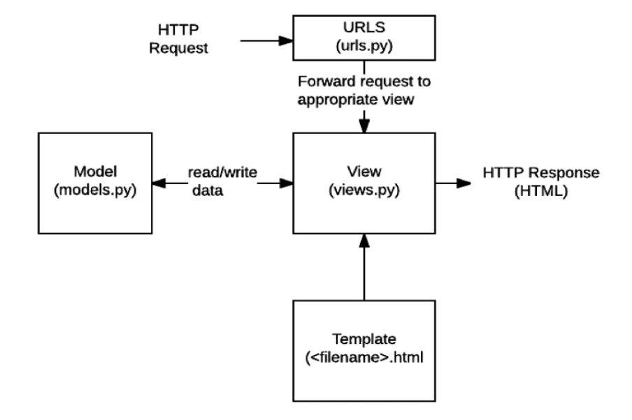
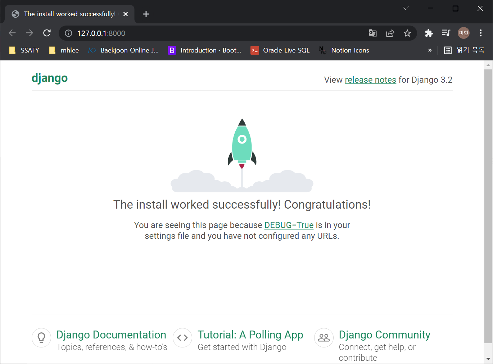

# Web Framework

## Django

Django is a high-level ***Python web framework*** that encourages rapid development and clean, pragmatic design. Built by experienced developers, it takes care of much of the hassle of web development, so ***you can focus on writing your app without needing to reinvent the wheel.***

## Web

* World Wide Web
* 인터넷에 연결된 컴퓨터를 통해 정보를 공유할 수 있는 전 세계적인 정보 공간

> ⭐ 정적페이지와 동적페이지 차이

## Static web page (정적 웹 페이지)

* 서버에 미리 저장된 파일이 사용자에게 그대로 전달되는 웹페이지
* 서버가 정적 웹 페이지에 대한 요청을 받은 경우 서버는 추가적인 처리 과정 없이 클라이언트에게 응답을 보냄
* 모든 상황에서 모든 사용자에게 동일한 정보를 표시
* 일반적으로 HTML, CSS, JavaScript 로 작성됨
* flat page 라고도 함

## Dynamic web page (동적 웹 페이지)

* 웹 페이지에 대한 요청을 받은 경우 서버는 추가적인 처리 과정 이후 클라이언트에게 응답을 보냄
* 동적 페이지는 방문자와 상호작용하기 때문에 페이지 내용은 그때그때 다름
* 서버사이드 프로그래밍 언어 (Python, java, C++등)가 사용되며 파일을 처리하고 데이터베이스와의 상호작용이 이루어짐

## Framework

* 프로그래밍에서 특정 운영 체제를 위한 응용 프로그램 표준 구조를 구현하는 클래스와 라이브러리 모임
* 재사용할 수 있는 수많은 코드를 프레임워크로 통합함으로써 개발자가 새로운 애플리케이션을 위한 표준 코드를 다시 작성하지 않아도 같이 사용할 수 있도록 도움
* Application Framework 라고도 함

## Web framework

* ***웹 페이지를 개발하는 과정에서 겪는 어려움을 줄이는 것이 주 목적***으로 데이터베이스 연동, 템플릿 형태의 표준, 세션 관리, 코드 재사용 등의 기능을 포함
* 동적인 웹페이지나, 웹 애플리케이션, 웹 서비스 개발 보조용으로 만들어지는 Application Framework 의 일종

## Django를 사용해야 하는 이유

* 검증된 Python 언어 기반 Web framework
* 대규모 서비스에도 안정적이며 오랫동안 세계적인 기업들에 의해 사용됨
  * spotify, Instagram, Dropbox, Delivery Hero...

## Framework Architecture

* MVC Design Pattern (model-view-controller)
* 소프트웨어 공학에서 사용되는 디자인 패턴 중 하나
* 사용자 인터페이스로부터 프로그램 로직을 분리하여 애플리테이션의 시각적 요소나 이면에서 실행되는 부분을 서로 영향없이 쉽게 고칠 수 있는 애플리케이션을 만들 수 있음
* Django 는 **MTV Pattern** (model-template-view) 이라고 함 

## MTV Pattern⭐

* Model
  * 응용프로그램의 데이터 구조를 정의하고 데이터베이스의 기록을 관리(추가, 수정, 삭제)
* Template
  * 파일의 구조나 레이아웃을 정의
  * 실제 내용을 보여주는데 사용 (Presentation)
* View
  * HTTP 요청을 수신하고 HTTP 응답을 반환
  * Model 을 통해 요청을 충족시키는데 필요한 데이터에 접근
  * template 에게 응답의 서식 설정을 맡김

|  MVC Pattern   | MTV (Django) |
| :------------: | :----------: |
|   **M**odel    |  **M**odel   |
|    **V**iew    | **T**emplate |
| **C**ontroller |   **V**iew   |




# Django Intro

## 가상환경 설정

```bash
$ python -m venv venv # 파이썬 venv 라는 모듈을 실행한다. 뒤에 있는 venv 는 가상환경 이름
$ source venv/Script/activate
(venv)
$ pip list
Package    Version
---------- -------
pip        21.2.4
setuptools 58.1.0
```

> vs code 에서 설정 및 확인 방법
>
> `ctrl + shift + p` : python select interpreter 에서 현재 디렉토리의 python version 선택

> ❗️ 가상환경은 git으로 관리하지 않는다.
>
> - gitignore 작성 시 venv 추가
> - `pip freeze > requirements.txt` 목록으로 관리
> - 이렇게 생성된 requirements.txt 파일을 git에 올린다.
>
> 💡 requirements.txt로 가상환경 설정하는 법
>
> * `pip install -r requirements.txt`

## Django 시작하기

* Django 설치 전 가상환경 생성 및 활성화

### Django 설치 (현재 3.2버전이 LTS)

> LTS (Long Term Support)
>
> - 일반적인 경우보다 장기간에 걸쳐 지원하도록 고안된 소프트웨어의 버전
> - 컴퓨터 소프트웨어의 제품 수명주기 관리 정책
> - 배포자는 LTS 확정을 통해 장기적이고 안정적인 지원을 보장함

* ❗️2021년 21월 Django 4.0 릴리즈 이후 버전을 명시하지 않으면 4.0 버전이 설치되니 주의! 

```bash
$ pip install django==3.2.12
$ pip list
Package    Version
---------- -------
asgiref    3.5.0
Django     3.2.12
pip        21.2.4
pytz       2021.3
setuptools 58.1.0
sqlparse   0.4.2
```

### 프로젝트 생성⭐

* `django-admin startproject <프로젝트명> .`
* 프로젝트 이름에는 python이나 django 에서 사용중인 키워드를 피해야 한다.
* '-' (하이픈) 도 사용할 수 없다.
* `.` 을 붙이지 않으면 manage.py 파일이 프로젝트 파일 아래에 생긴다.

### 서버 시작하기(활성화)

* `python manage.py runserver`
* http://127.0.0.1:8000/ 접속 시 다음과 같은 창 뜨면 서버 정상적으로 활성화 된 것



### 프로젝트 구조⭐

* `__init__.py` : Python 에게 이 디렉토리를 하나의 Python 패키지로 다루도록 지시
* `asgi.py` : Asynchronous Server Gateway Interface, django 애플리케이션이 비동기식 웹 서버와 연결 및 소통하는 것을 도움
* **` settings.py` : 애플리케이션의 모든 설정을 포함**
* **`urls.py` : 사이트의 url 과 적절한 views의 연결을 지정**
* `wsgi.py` : Web Server Gateway Interface, django 애플리케이션이 웹서버와 연결 및 소통하는 것을 도움
* **`manage.py` : django 프로젝트와 다양한 방법으로 상호작용하는 커맨드라인 유틸리티**

### Application 생성

* 일반적으로 Application명은 ***복수형***으로 하는 것을 권장

```bash
$ python manage.py startapp articles
```

### Application 구조⭐

* `admin.py` : 관리자용 페이지를 설정 하는 곳
* `apps.py` : 앱의 정보가 작성된 곳
* `models.py` : 앱에서 사용하는 Model 을 정의하는 곳
* `tests.py` : 프로젝트의 테스트 코드를 작성하는 곳
* `views.py` : view 함수들이 정의 되는 곳

> ⭐ urls.py 는 app생성시에는 자동 생성되지 않는다.

### Project & Application ⭐

* Project
  * 프로젝트는 앱의 집합 (collection of apps)
  * **프로젝트는 여러 앱이 포함될 수 있음**
  * 앱은 여러 프로젝트에 있을 수 있음
* Application
  * 앱은 실제 요청을 처리하고 페이지를 보여주고 하는 등의 역할을 담당
  * 하나의 프로젝트는 여러 앱을 가짐
  * 일반적으로 앱은 하나의 역할 및 기능 단위로 작성함

### 앱(Application) 등록

* 프로젝트에서 앱을 사용하기 위해서는 반드시 `INSTALLED_APPS`리스트에 추가해야함

  * `settings.py`에 위치
  * Django installation 에 활성화 된 모든 앱을 지정하는 문자열 목록

  ```python
  INSTALLED_APPS = [
      'articles',	# 첫번째에 application 명 추가!
      'django.contrib.admin',
      'django.contrib.auth',
      'django.contrib.contenttypes',
      'django.contrib.sessions',
      'django.contrib.messages',
      'django.contrib.staticfiles',
  ]
  ```

  >  💡반드시 생성 후 등록!⭐
  >
  > `INSTALLED_APPS`에 먼저 등록하고 생성하려면 앱이 생성되지 않음


# 요청과 응답

## URLs (urls.py)

* HTTP 요청(request)을 알맞은 view로 전달⭐

* `urls.py`에서 urlpatterns 리스트에 view 추가

  ```python
  # firstpjt/urls.py
  from django.contrib import admin
  from django.urls import path
  from articles import views # articles 의 views 모듈 import
  
  urlpatterns = [
      path('admin/', admin.site.urls),
      path('index/', views.index), #views의 index 함수 호출
  ]
  ```

  > Django 에서는 trailing comma를 권장
  >
  > - list 마지막의 `,`
  > - 생산성 향상을 위함


## View⭐

* HTTP 요청을 수신하고 HTTP 응답을 반환하는 함수 작성
* Model 을 통해 요청에 맞는 필요 데이터에 접근
* Template에게 HTTP 응답 서식을 맡김
* `views.py`에서 view 함수 생성

```python
# articles/views.py
from django.shortcuts import render

# Create your views here.
def index(request):
    return render(request, 'index.html')
```


## Templates⭐

* 실제 내용을 보여주는데 사용되는 파일
* 파일의 구조나 레이아웃을 정의 (ex. HTML)
* Template 파일 경로의 기본값은 ***app 폴더 안의 templates 폴더***로 지정되어 있음
* application 폴더에서 `templates` 폴더 생성 후 `index.html`파일 추가


* 서버 실행 후 http://127.0.0.1:8000/index/ 접속하면 index.html 작성 내용 확인 가능

  

## 추가 설정 (settings.py)⭐

* `LANGUAGE_CODE`
  * `LANGUAGE_CODE = 'ko-kr'`
  * 모든 사용자에게 제공되는 번역을 결정
  * 이 설정이 적용되려면 `USE_I18N`이 활성화 되어있어야 함
* `TIME_ZONE` 
  * 데이터베이스 연결의 시간대를 나타내는 문자열 지정
  * `USE_TZ`가 True 이고 이 옵션이 설정된 경우 데이터베이스에서 날짜 시간을 읽으면, UTC 대신 새로 설정한 시간대의 인식 날짜&시간이 반환 됨
* `USE_I18N`
  * Django 의 번역 시스템을 활성화해야 하는지 여부를 지정
* `USE_L10N`
  * 데이터의 지역화 된 형식(localized formatting) 을 기본적으로 활성화할지 여부를 지정
  * True일 경우, Django는 현재 locale 의 형식을 사용하여 숫자와 날짜를 표시
* `USE_TZ`
  * datetimes 가 기본적으로 시간대를 인식하는지 여부를 지정
  * True일 경우 Django 는 내부적으로 시간대 인식 날짜/시간을 사용

# Template

## Django Template

* 데이터 표현을 제어하는 도구이자 표현에 관련된 로직
* 사용하는 built-in system
  * Django template language (DTL)

## Django Template Language (DTL)⭐

* Django template 에서 사용하는 **built-in template system**
* 조건, 반복, 변수 치환, 필터 등의 기능을 제공
* 단순히 Python 이 HTML에 포함된 것이 아니며, 프로그래밍적 로직이 아니라 **프레젠테이션을 표현하기 위한 것**
* Python 처럼 일부 프로그래밍 구조(it, for등)를 사용할 수 있지만, 이것은 해당 Python 코드로 실행되는 것이 아님!
* https://docs.djangoproject.com/en/3.2/ref/templates/builtins/ ⭐⭐⭐

## DTL Syntax⭐

* Variable
  * `{{ variable }}`
  * render()를 사용하여 views.py 에서 정의한 변수를 template 파일로 넘겨 사용하는 것
  * 변수 명은 영어, 숫자와 밑줄(_)의 조합으로 구성될 수 있으나 밑줄로는 시작할 수 없음
    * 공백이나 구두점 문자 또한 사용할 수 없음
  * dot(.)를 사용하여 변수 속성에 접근할 수 있음
  * render()의 세번째 인자로 `{'key': value}` 와 같이 딕셔너리 형태로 넘겨주며,
    여기서 정의한 key 에 해당하는 문자열이 template 에서 사용 가능한 변수명(variable)이 됨
* Filters
  * `{{ variable|filter}}`
  * 표시할 변수를 수정할 때 사용
  * 60개의 built-in template filters 를 제공
  * chained 가 가능하며 일부 필터는 인자를 받기도 함

* Tags
  * ``
  * 출력 텍스트를 만들거나, 반복 또는 논리를 수행하여 제어 흐름을 만드는 등 변수보다 복잡한 일들을 수행
  * 일부 태그는 시작과 종료태그가 필요
    * ``
    * 약 24개의 built-in template tags 를 제공
* Comments
  * 한줄 주석 : `{# #}`
  * 여러줄 주석: ``

## 코드 작성 순서

* 데이터의 흐름에 맞추어 작성
  * `urls.py` -> `views.py` -> `templates`

## Template inheritance (템플릿 상속)

* 템플릿 상속은 기본적으로 코드의 재사용성에 초점을 맞춤
* 템플릿 상속을 사용하면 사이트의 모든 공통 요소를 포함하고, 하위 템플릿이 재정의(override) 할 수 있는 블록을 정의하는 기본 "skeleton" 템플릿을 만들 수 있음

```python
# settings.py
TEMPLATES = [
  {
    ...
    'DIRS' : [BASE_DIR / 'templates'], ###⭐###
  },
]
```

### Template Tag⭐

* ``
  * 자식(하위) 템플릿이 부모 템플릿을 확장한다는 것을 알림
  * ⭐️반드시 템플릿 최상단에 작성 되어야 함
* ` `
  * 하위 템플릿에서 재지정(overridden)할 수 있는 블록을 정의
  * 즉, 하위 템플릿이 채울 수 있는 공간
* ``
  * 템플릿을 로드하고 현재 페이지로 렌더링
  * *템플릿 내에 다른 템플릿을 포함하는 방법*
  * 주로 파일명 앞에 '_'(언더바)를 붙여 include 되는 템플릿을 분류함

### Django template system (feat. Django 설계 철학)

* 표현과 로직(view)을 분리
  * 템플릿 시스템은 표현을 제어하는 도구이자 표현에 관련된 로직일 뿐이라고 생각한다.
  * 즉, 템플릿 시스템은 이러한 기본목표를 넘어서는 기능을 지원하지 말아야 한다.
* 중복을 배제
  * 대다수의 동적 웹사이트는 공통 header, footer, navbar 같은 사이트 공통 디자인을 갖는다.
  * Django 템플릿 시스템을 이러한 요소를 한 곳에 저장하기 쉽게 하여 중복 코드를 없애야 한다.
  * 이것이 템플릿 상속의 기초가 되는 철학이다.

# HTML Form

## HTML "form" element

* 웹에서 사용자 정보를 입력하는 여러 방식(text, button, checkbox, file, hidden, image, password, radio, reset, submit)을 제공하고, 사용자로부터 입력받은 데이터를 서버로 전송하는 역할을 담당
* 핵심 속성 (attribute)⭐
  * **action** : 입력된 데이터가 전송될 URL 지정
  * **method** : 입력 데이터 전달 방식 지정

## HTML "input" element

* 사용자로부터 데이터를 입력 받기 위해 사용
* type 속성에 따라 동작 방식이 달라짐
* 핵심 속성 (attribute)
  * **name⭐**
  * 중복 가능, 양식을 제출했을 때 name 이라는 이름에 설정된 값을 넘겨서 값을 가져올 수 있음
  * 주요 용도는 GET/POST 방식으로 서버에 전달하는 파라미터 (name은 key, value는 value)로 매핑하는 것
  * GET 방식에서는 URL 에서 `?key=value&key=value`형식으로 데이터를 전달함

## HTML "label" element

* 사용자 인터페이스 항목에 대한 설명 (caption)을 나타냄
* label 을 input 요소와 연결하기
  1. input 에 id 속성 부여
  2. label 에는 input 의 id와 동일한 값의 for 속성이 필요
* label 과 input 요소 연결의 주요 이점
  * 시각적인 기능 뿐만 아니라 화면 리더기에서 label 을 읽어 사용자가 입력해야 하는 텍스트가 무엇인지 더 쉽게 이해할 수 있도록 돕는 프로그래밍적 이점도 있음
  * label 을 클릭해서 input 에 초점(focus)를 맞추거나 활성화(activate) 시킬 수 있음


## HTML "for" attribute

* for 속성의 값과 일치하는 id를 가진 문서의 첫번째 요소를 제어

  * 연결된 요소가 labelable elements 인 경우 이 요소에 대한 labeled control 이 됨

  > labelable elements?
  >
  > * label 요소와 연결할 수 있는 요소
  > * button, input(not hidden type), select, textarea, ...

## HTML "id" attribute

* 전체 문서에서 고유(must be unique)해야 하는 식별자를 정의
* 사용 목적
  * linking, scripting, styling 시 요소를 식별

## HTTP

* HyperText Transfer Protocol
* 웹에서 이루어지는 모든 데이터 교환의 기초
* 주어진 리소스가 수행 할 작업을 나타내는 request methods를 정의
* HTTP request method 종류
  * GET, POST, PUT, DELETE ...
  * django 에서는 GET과 POST 만 지원

### HTTP request method - "GET"

* 서버로부터 **정보를 조회**하는 데 사용
* 데이터를 가져올 때만 사용해야 함
* 데이터를 서버로 전송할 때 body 가 아닌 Query String Parameters 를 통해 전송
  * Query String Parameters : 주소로 데이터가 전달되는 형태 (`?key=value&key=value`)
* 우리는 서버에 요청을 하면 HTML 문서 파일 한장을 받는데, 이때 사용하는 요청의 방식이 GET

# URL

## Django URLs

* Dispatcher (발송자, 운항 관리자)로서의 URL
* 웹 애플리케이션은 URL 을 통한 클라이언트의 요청에서부터 시작됨

## Variable Routing⭐

>  django에서는 `'Dispatcher'`로 검색

* URL 주소를 변수로 사용하는 것 (url 주소에서 일부에다가 data를 담아서 보내는 것)

* URL 의 일부를 변수로 지정하여 view 함수의 인자로 넘길 수 있음

* 즉, 변수 값에 따라 하나의 path()에 여러 페이지를 연결 시킬 수 있음

  ```python
  path('accounts/user/<int:user_pk>/', ...)
  # accounts/users/1 -> 1번 user 관련 페이지
  # accounts/users/2 -> 2번 user 관련 페이지
  ```

## URL Path converters⭐

* 자동으로 설정한 타입으로 형변환해서 전달해준다.

* **str**
  * `'/'` 를 제외하고 비어있지 않은 모든 문자열과 매치
  * 작성하지 않을 경우 기본 값 (되도록 명시하자!)
* **int**
  * 0 또는 양의 정수와 매치
* **slug**
  * ASCII 문자 또는 숫자, 하이픈 및 밑줄 문자로 구성된 모든 슬러그 문자열과 매치
  * ex ) 'building-your-1st-django-site'
* uuid
* path

## App URL mapping

* app의 view 함수가 많아지면서 사용하는 path() 또한 많아지고, app 또한 더 많이 작성되기 때문에 프로젝트의 urls.py 에서 모두 관리하는 것은 프로젝트 유지보수에 좋지 않음
* 이제는 **각 app에 urls.py를 작성**하게 됨

```python
# articles/urls.py 기본 형태
from django.urls import path
from . import views # django 는 명시적 상대경로(from .module import ..) 를 권장

urlpatterns = [
]

# ../urls.py
from django.urls import path, include
urlpatterns = [ # urlpatterns는 언제든지 다른 URLconf 모듈을 포함(include)할 수 있음
    ...
    path('articles/', include('articles.urls')),
]
```

* `include()`⭐
  * 다른 URLconf(app1/urls.py) 들을 참조할 수 있도록 도움
  * 함수 include() 를 만나게 되면, URL 의 그 시점까지 일치하는 부분을 잘라내고, 남은 문자열 부분을 후속처리를 위해 include 된 URLconf로 전달
  * **django 는 명시적 상대경로(`from .module import ..`) 를 권장**


## Naming URL patterns⭐

* 이제는 링크에 URL 을 직접 작성하는 것이 아니라 path() 함수의 name 인자를 정의해서 사용

* Django Template Tag 중 하나인 url 태그를 사용해서 path() 함수에 작성한 name을 사용할 수 있음

* url 설정에 정의된 특정한 경로들의 의존성을 제거할 수 있음

  ```python
  # urls.py에서 다음과 같이 설정
  path('index/', views.index, name='index'),
  
  # html에서의 사용
  <a href="">메인 페이지</a>
  ```

* ``

  * 주어진 URL 패턴 이름 및 선택적 매개 변수와 일치하는 절대경로주소를 반환
  * 템플릿에 URL 을 하드코딩하지 않고도 DRY 원칙을 위반하지 않으면서 링크를 출력하는 방법

> DRY (Don't Repeat Yourself)
