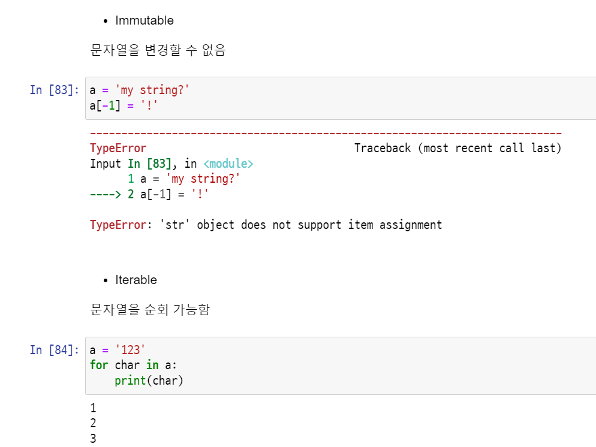
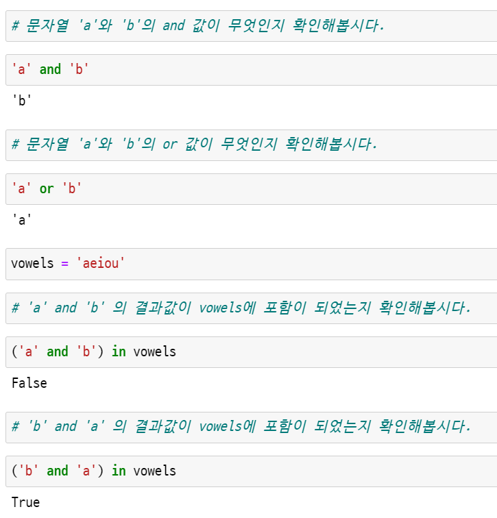

*2022.01.18.화*

# 0118_TIL

## 1. Immutable & Iterable

* Immutable : 변경할 수 없음
* Iterable : 순회 가능함

ex) 문자열 (String Type)



## 2. 날짜 출력

* datetime 모듈로 시간 출력 가능

```python
import datetime
today = datetime.datetime.now()
print(today)
```

```bash
2022-01-18 20:53:02.139184
```

* f-srting

```python
# interpolation에서 출력형식을 지정할 수 있습니다.
# today에 저장된 시간을 YYYY년, mm월, dd일, a요일 로 구분해서 출력해봅시다.
# 각각 %y, %m, %A를 사용합니다.
print(f'오늘은 {today:%y}년 {today:%m}월 {today:%d}일 {today:%A}')
```

```bash
오늘은 22년 01월 18일 Tuesday
```

* f-strings에서는 연산과 출력형식 지정도 가능

  ```python
  pi = 3.141592
  print(f'원주율은 {pi:.3}, 반지름이 2일 때 원의 넓이는 {pi*2*2}')
  ```

  ```bash
  원주율은 3.14, 반지름이 2일 때 원의 넓이는 12.566368
  ```


## 3. tuple 생성 시 주의할 점

하나의 항목으로 구성된 튜플은 생성 시 값 뒤에 쉼표를 붙여야 한다.

복수 항목의 경우 마지막 항목에 붙은 쉼표는 생략할 수 있다.

```python
# 하나의 항목으로 구성된 튜플은 생성 시 값 뒤에 쉼표를 붙여야 합니다.
a = 1,
print(a)
print(type(a))
```

```bash
(1,)
<class 'tuple'>
```


```python
# 길이가 1인 tuple을 만들 때 쉼표가 없는 경우 어떻게 되는지 확인 해봅시다.
tuple_or_not = ('hello')
print(tuple_or_not)
print(type(tuple_or_not))
```

```bash
hello
<class 'str'>
```


## 4. 컨테이너(Container) 정리


## 5. 단축평가 (short-circuit evaluation)

* 첫번째 값이 확실할 때, 두 번째 값은 확인하지 않습니다.
* 조건문에서 뒷 부분을 판단하지 않아도 되기 때문에 속도가 향상됩니다.



- `and` 는 둘 다 `True`일 경우만 `True`이기 때문에 첫 번째 값이 `True`라도 두번째 값을 확인해야 하기 때문에 `'b'`가 반환됩니다.
- `or` 는 하나만 `True`라도 `True`이기 때문에 `True`를 만나면 해당 값을 바로 반환합니다.

ex)

```python
# and의 단축평가(short-circuit evaluation)에 대해서 알아봅시다.
# (3 and 5) , (3 and 0), (0 and 3), (0 and 0) 의 결과를 print로 출력해봅시다.
print(3 and 5)
print(3 and 0)
print(0 and 3)
print(0 and 0)
```

```bash
5
0
0
0
```

```python
print(5 or 3)
print(3 or 0)
print(0 or 3)
print(0 or 0)
```

```bash
5
3
3
0
```

## 6. enumerate()

인덱스와 값을 함께 활용 가능하다.


* 숫자를 1부터 카운트 할 수 있다.

```python
# enumerate() 에 의해 반환되는 인덱스가 1로 시작하여 카운트되는 for 반복문을 작성해봅시다.
for idx, member in enumerate(members, start=1):
    print(idx, member)
```

```bash
1 민수
2 영희
3 철수
```

