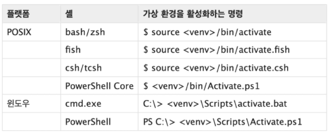

*2022.01.19.수*

# 모듈

## 1. 모듈과 패키지

* 모듈
  * 특정한 기능을 하는 코드를 파이썬 파일(.py) 단위로 작성한 것
* 패키지
  * 특정 기능과 관련된 여러 모듈의 집합
  * 패키지 안에는 또 다른 서브 패키지를 포함
* 모듈과 패키지 불러오기
  * import 모듈
    * 해당 모듈 전체를 가져온다.
    * 사용하려면 항상 '모듈명.메소드' 와 같이 모듈명을 앞에 붙여주어야 한다.
  * from 모듈 import 메소드/모듈
    * 해당 모듈 내에 있는 특정 메소드나 모듈 내 정의된 변수를 가져온다.
    * 가져온 메소드나 변수를 앞에 모듈명을 붙이지 않고 그대로 사용할 수 있다.
    * 다만, 이름이 같은 변수나 메소드가 존재할 경우 대체된다.

## 2. 파이썬 표준 라이브러리

https://docs.python.org/ko/3/library/index.html

* 파이썬 패키지 관리자(pip)
  * PyPI (Python Package Index)에 저장된 외부 패키지들을 설치하도록 도와주는 패키지 관리 시스템
  * pip 는 패키지를 업그레이드 하는 경우 과거 버전을 자동으로 지워줌
* `pip install/uninstall`
* `pip list`
* `pip show SomePackage`
* `pip freeze`
  * 설치된 패키지의 비슷한 목록을 만들지만, pip install 에서 활용되는 형식으로 출력
  * 해당하는 목록을 requirements.txt 으로 만들어 관리함
  * `pip freeze > requirements.txt`
  * `pip install -r requirements.txt`

## 3. 사용자 모듈과 패키지

### 3.1 모듈 실습

1. check.py

   ```python
   def odd(n):
       return bool(n % 2)
   
   def even(n):
       return not bool(n % 2)
   ```

2. check 모듈 활용

   ```python
   import check
   
   check.odd(3)
   check.even(3)
   ```

   ```python
   from check import *
   
   odd(5)
   even(5)
   ```


### 3.2 패키지 실습

* 패키지는 여러 모듈/하위 패키지로 구조화
* 모든 폴더에는 `__init.py__` 를 만들어 패키지로 인식
  * python 3.3 부터는 파일이 없어도 되지만, 하위 버전 호환 및 프레임워크등에서의 동작을 위해 파일 생성을 권장

1. `calcpkg`폴더를 생성

2. `calcpkg`폴더 안에 `__init__.py`파일 생성

   ```python
   # __init__.py 파일은 내용을 비워 둘 수 있음
   ```

3. `operation.py` 파일 생성

   ```python
   def add(a, b):
       return a + b
    
   def mul(a, b):
       return a * b
   ```

4. `geometry.py` 파일 생성

   ```python
   def triangle_area(base, height):
       return base * height / 2
   
   def rectangle_area(width, height):
       return width * height
   ```

5. 패키지 사용

   ```python
   import calcpkg.operation
   import calcpkg.geometry
   
   print(calcpkg.operation.add(10, 20))
   print(calcpkg.operation.mul(10, 20))
   
   print(calcpkg.geometry.triangle_area(30, 40))    # geometry 모듈의 triangle_area 함수 사용
   print(calcpkg.geometry.rectangle_area(30, 40))   # geometry 모듈의 rectangle_area 함수 사용
   ```

   ```bash
   30
   200
   600.0
   1200
   ```

   ```python
   from calcpkg.operation import *
   print(add (10, 20))
   print(mul (10, 20))
   ```

   ```bash
   30
   200
   ```

   

## 4. 가상환경

*  venv

  * Python 3.5 부터 가상환경을 만들고 관리하는 모듈 지원

  * 특정 디렉토리에 가상환경을 만들고, 고유한 파이썬 패키지 집합을 가질 수 있음

  * `python -m venv <폴더명>`

    

  * `source venv/Scripts/activate` : 가상환경 활성화

  * `deactivate` : 가상환경 비활성화