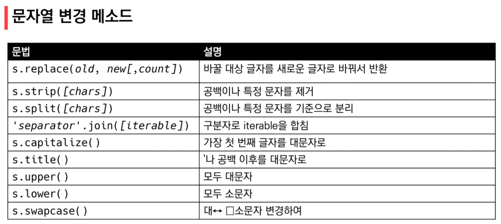
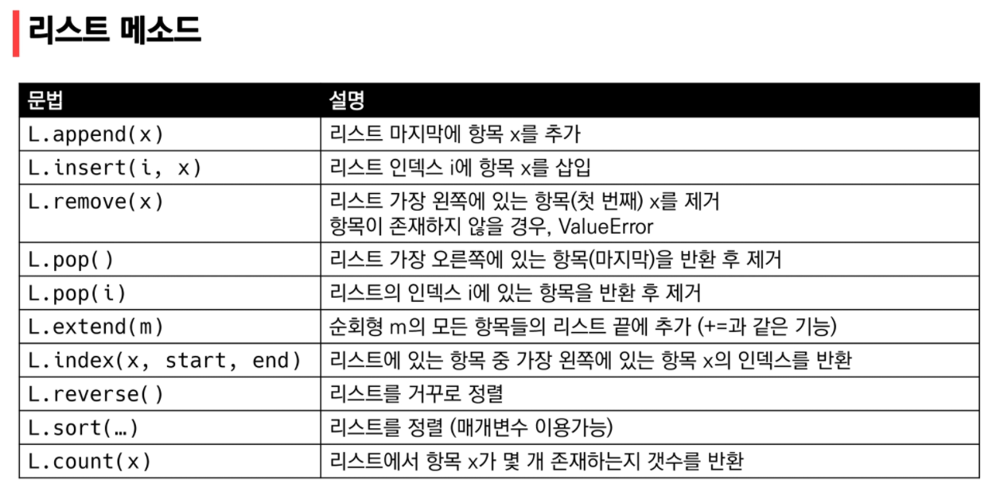
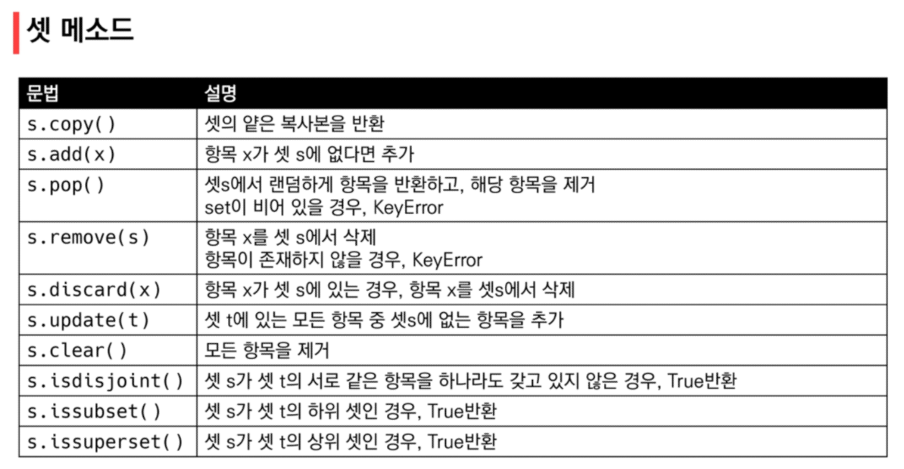
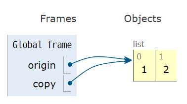
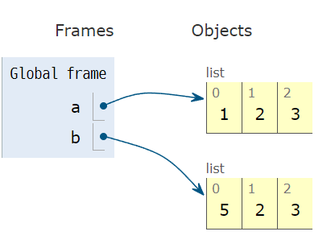
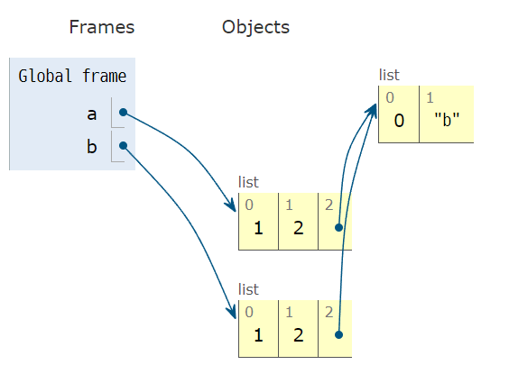
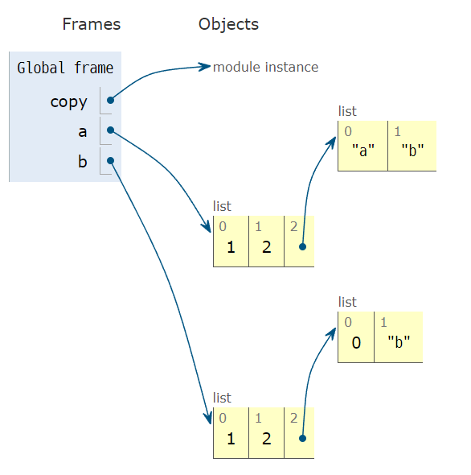

*2022.01.24.월요일*

# 데이터 구조 및 활용

## 1. 순서가 있는 데이터 구조

### 1.1 문자열 (String Type)



* `.replace(ole, new[, count])`

  * 바꿀 대상 글자를 새로운 글자로 바꿔서 반환
  * count 를 지정하면, 해당 개수만큼만 시행

* `strip([chars])`

  * 특정한 문자들을 지정하면,
    * 양쪽을 제거하거나(strip), 왼쪽을 제거하거나(lstrip), 오른쪽을 제거(rstrip)
    * 문자열 지정하지 않으면 공백을 제거함

* `.split([chars])`

  * 문자열을 특정한 단위로 나눠 리스트로 변환

* `'separator'.join([iterable])`

  * 반복가능한(iterable) 컨테이너 요소들을 separator(구분자)로 합쳐 문자열 반환

    ```python
    >>> '!'.join('ssafy')
    's!s!a!f!y'
    ```

    

### 1.2 리스트 (List)

* 순서를 가지는 0개 이상의 객체를 참조하는 자료형

* 항상 대괄호 형태로 출력 : []



* `.append(x)`
  * 리스트 마지막에 항목 x를 추가
* `.extend(iterable)`
  * 리스트에 iterable 의 항목을 추가함
* `.insert(i, x)`
  * 정해진 위치 i에 값 x를 추가함
  * i가 리스트 길이보다 큰 경우 맨 위에 추가한다.
* `.remove(x)`
  * 리스트에서 값이 x인 것 삭제 (두개 이상 있어도 하나만 삭제)
  * 없는 경우 ValueError
* `.pop(i)`
  * 정해진 위치 i에 있는 값을 삭제하고 그 값을 반환함
  * i가 지정되지 않으면, 마지막 항목을 삭제하고 반환함
* `.clear()`
  * 모든 항목을 삭제함
* `.index()`
  * x 값을 찾아 해당 index값을 반환
  * 없는 경우 ValueError
* `.count(x)`
  * 원하는 값의 개수를 반환함
* `.sort()`
  * 원본 리스트를 정렬함. `None` 반환
  * `sorted` 함수와 비교
    * `.sort()` : 원본을 변경
    * `sorted` : 정렬된 리스트를 반환. 원본 변경 없음
* `.reverse()`
  * 순서를 반대로 뒤집음, `None`반환

> **튜플(tuple)**
>
> * 순서를 가지는 0개 이상의 객체를 참조하는 자료형
> * immutable : 생성 후, 담고 있는 객체 변경이 불가
> * 튜플을 변경할 수 없기 때문에 값에 영향을 미치지 않는 메소드만을 지원


## 2. 순서가 없는 데이터 구조

### 2.1 셋 (Set)

* 순서없이 0개 이상의 해시 가능한 객체를 참조하는 자료형
* mutable : 담고있는 객체를 삽입 변경, 삭제 가능 



* `.add(elem)`
  * 셋에 값을 추가
* `.update(*others)`
  * 여러 값을 추가
* `.remove(elem)`
  * 셋에서 삭제하고, 없으면 KeyError
* `.discard(elem)`
  * 셋에서 삭제하고 없어도 에러가 발생하지 않음
* `.pop()`
  * 임의의 원소를 제거해 반환


### 2.2 딕셔너리 (Dictionary)

* 순서 없이 key-value 쌍으로 이루어진 객체를 참조하는 유형


* `.get(key[,default])`

  * key 를 통해 value를 가져옴
  * KeyError 가 발생하지 않으며, defult 값을 설정할 수 있음 (기본: None)

* `.pop(key[,default])`

  * key 가 딕셔너리에 있으면 제거하고 해당 값을 반환
  * 그렇지 않으면 default 를 반환
  * default 값이 없으면 KeyError

* `.update()`

  * 값을 제공하는 key, value 로 덮어씀

  ```python
  >>> mydict = {'apple':'사', 'banana':'바나나'}
  >>> print(mydict)
  {'apple': '사', 'banana': '바나나'}
  >>> mydict.update(apple='사과')
  >>> print(mydict)
  {'apple': '사과', 'banana': '바나나'}
  ```

  

## 3. 얕은 복사(Shallow Copy) 와 깊은 복사(Deep Copy)

### 3.1 할당 (Assignment)

대입 연산자(=)를 통한 복사는 해당 객체에 대한 객체 참조를 복사

```python
origin = [1,2]
copy = origin
```




### 3.2 얕은 복사 (Shallow copy)

slice 연산자 활용하여 같은 원소를 가진 리스트지만 연산된 결과를 복사(다른 주소)

```python
a = [1,2,3]
b = a[:]
b[0] = 5
```




* 얕은 복사 주의사항

  * 복사하는 리스트의 원소가 주소를 참조하는 경우 deep copy 해야한다.

    ```python
    a = [1,2,['a','b']]
    b = a[:]
    print(a, b)
    b[2][0] = 0
    print(a, b)
         
    [1, 2, ['a', 'b']] [1, 2, ['a', 'b']]
    [1, 2, [0, 'b']] [1, 2, [0, 'b']]
    ```

    

### 3.3 깊은 복사 (Deep copy)

`import copy`

```python
import copy

a = [1,2,['a','b']]
b = copy.deepcopy(a)
print(a, b)
b[2][0] = 0
print(a, b)

[1, 2, ['a', 'b']] [1, 2, ['a', 'b']]
[1, 2, ['a', 'b']] [1, 2, [0, 'b']]
```

