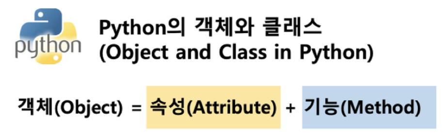

*2022.01.26.수요일*

# OOP

Object-Oriented Programming

## 1. 객체지향 프로그래밍

### 1.1 객체지향 프로그래밍

파이썬은 모두 객체(object)로 이뤄져 있다.

객체(object)는 특정 타입의 인스턴스(instance)이다.

* 123, 900, 5는 모두 int의 인스턴스
* 'hello', 'bye'는 모두 string 의 인스턴스
* [232, 89,1], [] 은 모두 list의 인스턴스

#### 객체의 특징

* 타입 (type) : 어떤 연산자와 조작 가능한가?
* 속성 (attribute) : 어떤 상태(데이터)를 가지는가?
* 기능 (method) : 어떤 행위(함수)를 할수 있는가?



#### 객체지향 프로그래밍

데이터가 스스로 매소드를 가지고 있고, 그걸 활용해서 데이터가 변화한다.

* 장점
  * 프로그램을 유연하고 변경이 용이하게 만들기 때문에 대규모 소프트웨어 개발에 많이 사용된다.
  * 프로그래밍을 더 배우기 싶게 하고 소프트웨어 개발과 보수를 간편하게 한다.
  * 보다 직관적인 코드 분석을 가능하게 한다.


### 1.2 OOP 기초

#### 기본 문법

```python
# 클래스 정의
class Myclass:
    pass

# 인스턴스 생성
my_instance = My class()

# 메서드 호출
my_instance.my_method()

# 속성
my_instance.my_attribute
```

#### 클래스와 인스턴스

* 객체의 틀(클래스)을 가지고, 객체(인스턴스)를 생성한다.

  * 클래스 : 객체들의 분류
  * 인스턴스 : 하나하나의 실체

  * 속성 : 특정 데이터 타입/클래스의 객체들이 가지게 될 상태/데이터를 의미
  * 메서드 : 특정 데이터 타입/클래스의 객체에 공통적으로 적용 가능한 행위(함수)

#### 객체 비교하기

* `==`
  * equal
  * 변수가 참조하는 객체가 동등한(내용이 같은) 경우 True
  * 두 객체가 같아 보이지만 실제로 동일한 대상을 가리키고 있다고 확인해 준 것은 아님
* `is`
  * idential
  * 두 변수가 동일한 객체를 가리키는 경우 True

### 1.3 인스턴스

#### 1.3.1 인스턴스 변수

* 인스턴스 변수란?
  * 인스턴스가 개인적으로 가지고 있는 속성
  * 각 인스턴스들의 고유한 변수
* 생성자 메소드에서 `self.<name>`으로 정의
* 인스턴스가 생성된 이후 `<instance>.<name>`으로 접근 및 할당

#### 1.3.2 인스턴스 메서드


### 1.4 클래스

### 1.5 매소드 정리


* 인스턴스 메소드
  * self 매개변수를 통해 동일한 객체에 정의된 속성 및 다른 메소드에 자유롭게 접근 가능
  * 클래스 자체에도 접근 가능 -> 인스턴스 메소드가 클래스 상태를 수정할 수도 있음
* 클래스 메소드
  * `@classmethod`
  * 클래스를 가리키는 cls 매개 변수를 받음
  * cls 인자에만 접근할 수 있기 때문에 객체 인스턴스 상태를 수정할 수 없음
* 스태틱 메소드
  * `@staticmethod`
  * 임의 개수의 매개변수를 받을 수 있지만, self 나 매개변수는 사용하지 않음
  * 객체 상태나 클래스 상태를 수정할 수 없음
  * 일반 함수처럼 동작하지만 클래스의 이름공간에 귀속됨
    * 주로 해당 클래스로 한정하는 용도로 사용

```python
class MyClass:
    def method(self):
        return 'instance method', self

    @classmethod
    def classmethod(cls):
        return 'class method', cls

    @staticmethod
    def staticmethod():
        return 'static method'

obj = MyClass()
print(obj.method())
print(MyClass.classmethod())
print(MyClass.staticmethod())
```

```bash
('instance method', <__main__.MyClass object at 0x000001F9250A3D30>)
('class method', <class '__main__.MyClass'>)
static method
```


## 2. 객체 지향의 핵심 개념

### 2.1 추상화

### 2.2 상속

* 두 클래스 사이 부모 - 자식 관계를 정립하는 것

* 클래스는 상속이 가능함
  * 모든 파이썬 클래스는 object 를 상속받음
* 하위 클래스는 상위 클래스에 정의된 속성, 행동, 관계 및 제약 조건을 모두 상속받음
* 부모 클래스의 속성, 메소드가 자식클래스에 상속되므로, 코드 재사용성이 높아짐

#### 2.2.1 상속 관련 함수와 메소드

* `isinstance(object, classinfo)`
  * classinfo의 instance 이거나 subclass 인 경우 True
* `super()`
  * 자식클래스에서 부모 클래스를 사용하고 싶은 경우

> **상속 정리**
>
> * 파이썬의 모든 클래스는 object 로부터 상속됨
> * 부모 클래스의 모든 요소(속성, 메소드)가 상속됨

#### 2.2.2 다중 상속

* 두 개 이상의 클래스를 상속받는 경우
* 상속 받은 모든 클래스의 요소를 활용 가능함
* 중복된 속성이나 메서드가 있는 경우 **상속 순서(먼저 상속된 클래스가 win) 에 의해 결정**됨

### 2.3 다형성 (Polymorphism)

* 동일한 메소드가 클래스에 따라 다르게 행동할 수 있다.
* 즉, 서로 다른 클래스에 속해있는 객체들이 동일한 메시지에 대해 다른 방식으로 응답될 수 있다.

#### 2.3.1 메소드 오버라이딩


### 2.4 캡슐화 (Encapsulation)

* 객체의 일부 구현 내용에 대한 외부로부터 직접적인 액세스를 차단
* 파이썬에서 ***암묵적***으로 존재하지만, ***언어적으로는 존재하지 않음***
  * Public Access Modifier
  * Protected Access Modifier
  * Private Access Modifier