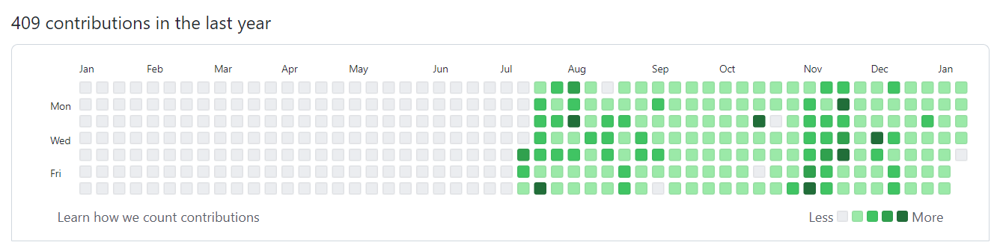

# Git & Github

## Why Git & Github?

### 1. Git을 이용한 버전 관리

* git : (분산) 버전 관리 프로그램
  * 버전 : 컴퓨터 소프트웨어의 특정 상태
  * 관리 : 어떤 일의 사무, 시설이나 물건의 유지/개량
  * 프로그램 : 컴퓨터에서 실행될 때 특정 작업을 수행하는 일련의 명령어들의 모음

* 중앙 집중식 버전 관리
* 분산 버전 관리

### 2. Github 를 이용한 포트폴리오

* TIL

## Git

### 1. 로컬 저장소

* Working Directory
* Staging Area
* Local Repository

#### 상태

* untracked :  working directory 에서 처음으로 관리되는 대상
* tracked : staging area 에서 관리되고 있는 대상
  * modified
  * unmodified

