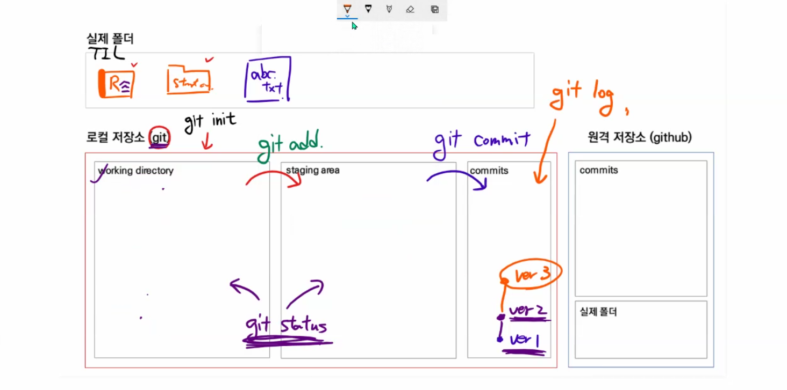

# Git & Github


## Why Git & Github?

### 1. Git을 이용한 버전 관리

* git : (분산) 버전 관리 프로그램
  * 버전 : 컴퓨터 소프트웨어의 특정 상태
  * 관리 : 어떤 일의 사무, 시설이나 물건의 유지/개량
  * 프로그램 : 컴퓨터에서 실행될 때 특정 작업을 수행하는 일련의 명령어들의 모음

* 중앙 집중식 버전 관리
* 분산 버전 관리


### 2. Github 를 이용한 포트폴리오

* TIL


## Git

>  git 은 분산버전관리시스템(DVCS) Distributed Control System
>
> 소스코드의 버전을 관리하고 이력도 관리할 수 있다.

### 준비하기

1. 윈도우에 git 을 설치한다. (git bash 설치)

2. 초기 설치 완료 후 로컬 컴퓨터에 `Author` 정보를 설정해야한다.

   ```bash
   $ git config --global user.email 유저이메일
   $ git config --global user.name 유저네임
   
   $ git config --global -l // 설정값을 확인하는 명령어
   ```


#### 1. 저장소 초기화

```bash
$ git init

~/TIL (master) // master 명 확인으로 git 관리여부 확인
```

| Working Directory                                            | Staging Area                                                 | Local Repository (commit)                       |
| ------------------------------------------------------------ | ------------------------------------------------------------ | ----------------------------------------------- |
| 실제 작업되는 공간<br />변경점이 나타나면 이곳에 파일이 등록 | commit 되기 전 임시로 파일들이 보여지는 곳<br />이곳에서 commit 되어도 되는지 파일을 확인 | git 으로 관리되는 파일들의 버전들이 저장되는 곳 |


#### 2. 상태 확인

```bash
$ git status // WD, SA 상태를 확인하기 위한 명령어
```

* Untracked

  * git 으로 관리되지 않았던 파일이 등록된 경우
  * WD에서 해당 단어를 확인할 수 있음

* Tracked

  * New file : git 으로 관리되지 않았던 파일이 Staging Area 에 등록되었을 때 확인할 수 있음
  * modified : git 으로 관리되는데 수정된 파일이 Staging Area 에 등록되었을 때 확인할 수 있음

  

#### 4. gitignore

* 프로젝트와 관련 없는 파일을 등록하여 commit 되지 않도록 하는 것
  * 민감한 개인 파일이나
  * 개인 컴퓨터 설정파일 (OS에서 활용되는 파일)
  * IDE 환경 설정 파일 (.idea/)
  * 가상환경 폴더 및 파일

* `.gitignore` 파일을 생성
  * 제외하고 싶은 파일을 등록
  * 파일명을 적어주면 끝
* gitignore.io 를 이용하면 편하게 `.gitignore` 파일을 작성할 수 있음
  * 단, 우리가 생성한 파일은 우리가 직접 등록해야함 (ex. 단순 참고 용도인 파일들)


#### 5. Commit 을 위한 준비

```bash
$ git add 파일명
$ git add . // 현재 폴더 내에 있는 변경/추가된 파일 모두를 등록
```

* Working Directory 에서 Staging Area 로 관리 파일들을 이동시키는 명령어
* Staging Area 에서 관리 대상에 대한 판단을 하고 commit 여부를 결정


#### 6. Commit 하기

```bash
$ git commit -m "커밋 메세지를 남기자! 유의미한 내용으로 작성"
```

* 버전 이력을 확정짓는 명령어
* 해당 시점의 파일 변경된 내용을 스냅샷으로 기록해 남긴다.


#### 7. Commit 이력 확인하기

```bash
$ git log
$ git log --oneline // 한 줄로 축약해서 보여줌
$ git log -p // 파일의 변경 내용도 같이 보여줌
$ git log -숫자       // 숫자만큼만 보여줌
```


### 원격 저장소 (remote repository)

* github/gitlab

#### 1. 원격 저장소 등록

* 사용을 하기 위해서는 로컬에 원격 저장소의 url 주소를 등록해야 함

  ```bash
  $ git remote add 저장소별명(origin) 저장소주소
  ```

* 등록된 원격 저장소의 주소를 확인하는 방법

  ```bash
  $ git remote -v
  ```

* 저장소 삭제

  ```bash
  $ git remote rm 저장소별명
  ```


#### 2. 원격 저장소에 commit 내용 보내기

* 로컬에 저장된 commit 을 원격 저장소로 전달하여 분산 버전 관리를 완성하는 부분

  ```bash
  $ git push 저장소별명 브랜치명
  $ git push -u origin master
  ```

  * -u : -set-upstream 의 shortcut 형태이고 저장소 별명과 브랜치 명을 설정


#### 3. 원격 저장소에서 내려받기

##### 1. git clone

* `git init`, `git remote add` 동작이 포함된 내려받기 명령어
* 아무것도 없는 상태일 때 사용

* `git clone 리모트레포주소`

##### 2. git pull

* remote 서버의 정보를 내려받는 명령어
* git 이 적용되어 있어야 한다. (.git 폴더가 존재해야함)
* remote 정보가 등록되어 있어야 한다.

* `git pull 리모트별명 브랜치명`


### 기타)

#### submodule warning 메세지를 봤다!!!

1. 어떤 폴더가 submodule  인지 확인한다.
2. 해당 폴더로 찾아가서 .git 폴더를 제거한다.
3. 이미 Staging Area 에 올라간 상태라면
   `git rm -rf --cached 폴더명`으로 해당 폴더를 Staging Area 에서 Working Directory 로 내린다.
4. `git status` 로 다시 상태를 체크하고
5. `git add` 로 staging area 에 다시 올린다.
6. 그리고 다시 `git status` 로 staging area 에 올라온 상태를 파악하고
7. `git commit` 을 한다.

* CLI 환경에서 (master)가 보이면 `git init`을 하지 않는게 좋다.
